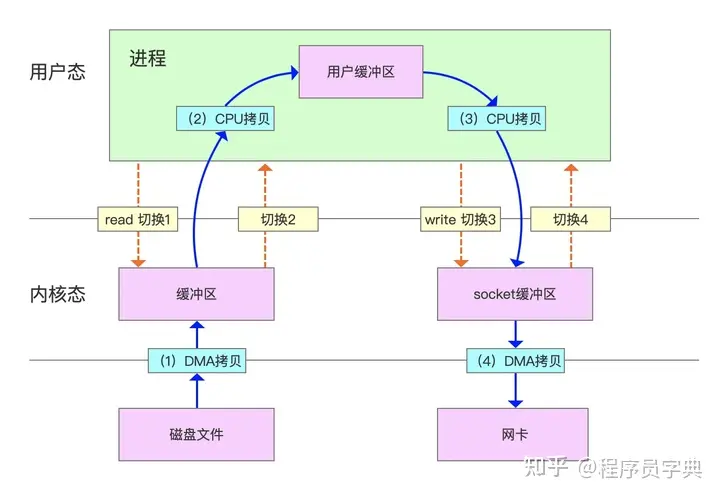
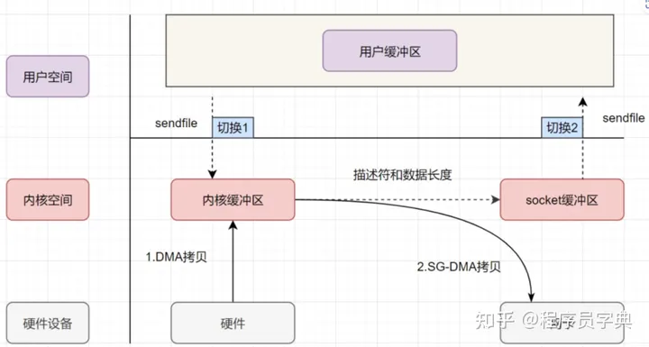
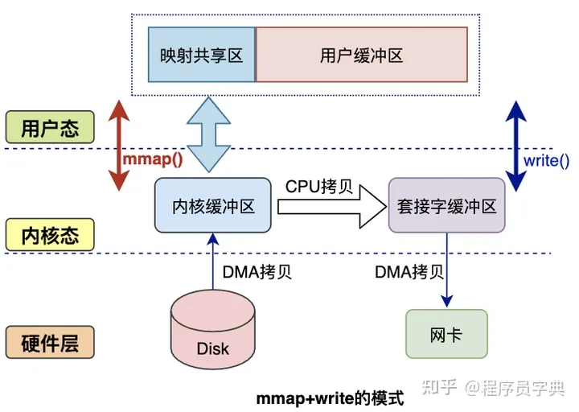
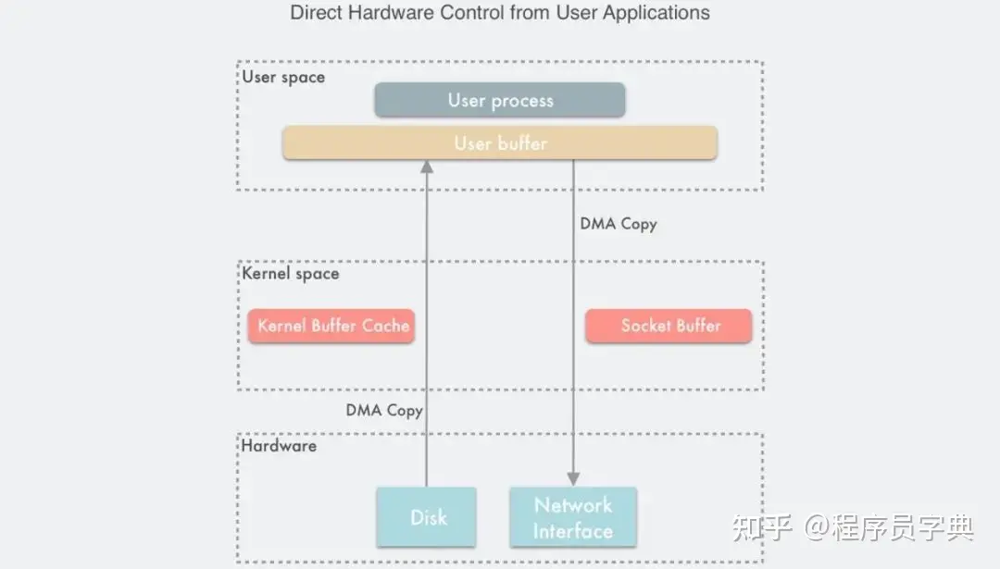
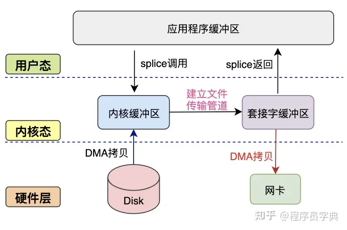

# 什么是零拷贝？

**零拷贝（Zero-Copy）** 是一种高效的数据传输技术，它可以将数据从内核空间直接传输到应用程序的内存空间中。

传统的数据传输过程通常需要经历多次内存拷贝。首先，从磁盘读取数据，然后将数据从内核空间拷贝到用户空间，再从用户空间拷贝到应用程序的内存中。这些额外的拷贝会消耗大量的CPU资源和内存带宽，降低数据传输的效率。零拷贝就是为了避免这些不必要的数据拷贝，能够将数据直接传输到目标内存区域，以提高数据传输的效率。

# 为什么要有零拷贝

**传统数据传输方式如图：**

1. 用户进程发出read()系统调用，触发上下文切换，从用户态转换到内核态。
2. CPU发起IO请求，通过直接内存访问（DMA）从磁盘读取文件内容，复制到内核缓冲区PageCache。
3. 将内核缓冲区数据，拷贝到用户空间缓冲区，触发上下文切换，从内核态转换到用户态。
4. 用户进程发起write系统调用，触发上下文切换，从用户态切换到内核态。
5. 将数据从用户缓冲区拷贝到内核中与目的地Socket关联的缓冲区。
6. 数据最终经由Socket通过DMA传送到网卡缓冲区，write()系统调用返回，并从内核态切换回用户态。

整个过程出现了多次不必要的数据拷贝，增加了CPU和内存的开销。

# 零拷贝实现原理

零拷贝实现方式，主要有以下几种

1. **sendfile ：** 这是一种在网络传输中实现零拷贝的方式。sendfile() 是一种特殊的系统调用，它允许在内核空间和用户空间之间直接传输数据，避免了数据在内核和用户空间之间的额外拷贝。这在高性能的网络传输中非常有效。
2. **mmap ：** mmap() 是另一种在文件传输中实现零拷贝的方式。它通过将文件映射到进程的地址空间，使得进程可以直接访问文件内容，而不需要经过中间缓冲区的拷贝。这样在文件读写时，数据可以直接在内核缓冲区和用户空间之间传输，从而实现零拷贝。
3. **Direct I/O ：** 是一种在文件传输中实现零拷贝的方式，也称为直接IO或裸IO。它允许数据在磁盘和用户空间之间直接传输，避免了数据在内核和用户空间之间的额外拷贝，从而实现零拷贝。
4. **splice ：** splice() 是一种在管道传输中实现零拷贝的方式。它允许将一个文件描述符的数据直接传输到另一个文件描述符，避免了数据在用户空间和内核空间之间的额外拷贝。

## sendfile

**sendfile 主要使用到了两个技术**

- DMA 技术
- 传递文件描述符代替数据拷贝

具体拷贝细节如下图：

1. 用户进程发起 sendfile() 系统调用， 上下文（切换1）从用户态转向内核态
2. DMA 控制器，把数据从硬盘中拷贝到内核缓冲区
3. CPU 把内核缓冲区中的 **文件描述符信息**（`包括内核缓冲区的内存地址和偏移量`)发送到 socket 缓冲区
4. DMA 控制器根据文件描述符信息，直接把数据从内核缓冲区拷贝到网卡
5. 上下文（切换2）从内核态切换回用户态，sendfile() 调用返回

> **注意:** 只有网卡支持 SG-DMA（The Scatter-Gather Direct Memory Access）技术才可以通过传递文件描述符的方式避免内核空间内的一次 CPU 拷贝。这意味着此优化取决于 Linux 系统的物理网卡是否支持（Linux 在内核 2.4 版本里引入了 DMA 的 scatter/gather – 分散/收集功能，只要确保 Linux 版本高于 2.4 即可）

### **mmap**

mmap是Linux提供的一种内存映射文件的机制，它实现了将内核中读缓冲区地址与用户空间缓冲区地址进行映射，从而实现内核缓冲区与用户缓冲区的共享。这样就减少了一次用户态和内核态的CPU拷贝，但是在内核空间内仍然有一次CPU拷贝。

mmap对大文件传输有一定优势，但是小文件可能出现碎片，并且在多个进程同时操作文件时可能产生引发coredump的signal。

### **Direct I/O**

Direct I/O 即直接 IO。其名字中的”直接”二字用于区分使用 page cache 机制的缓存 I/O,其他所有技术中，数据至少需要在内核空间存储一份，但是在 Direct I/O 技术中，数据直接存储在用户空间中，绕过了内核。如下图所示：

用户空间直接通过 DMA 的方式与磁盘以及网卡进行数据拷贝。

### **splice**

splice() 调用通常用于管道（pipe）和套接字（socket）之间的数据传输，可以大幅提高数据传输的效率和性能。主要涉及两个文件描述符（file descriptor）之间的数据传输，其中一个是源文件描述符（source file descriptor），另一个是目标文件描述符（target file descriptor）。数据将从源文件描述符传输到目标文件描述符，或者反过来，而且在传输过程中数据不需要经过用户空间。如下图：

splice() 的主要优势在于减少了数据拷贝的次数和数据在用户空间和内核空间之间的来回传输，从而显著提高了数据传输的效率。但它也有一些局限，它的两个文件描述符参数中有一个必须是管道设备。

## **结语**

零拷贝作为一项重要的优化技术，在数据传输和存储领域发挥着重要作用。通过避免不必要的数据拷贝，零拷贝技术大幅提升了数据传输效率，减少了CPU和内存的开销，加速了数据传输过程。在日益增长的数据需求和性能要求下，零拷贝技术的应用前景将更加广阔。我们期待着在未来的计算机领域中，零拷贝技术能够不断创新和发展，为数据传输和存储带来更多的优化与突破。