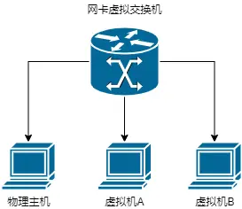
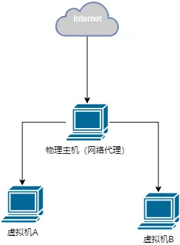
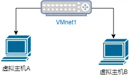

# 关于虚拟机的三种网络模式

三种网络模式：

- 桥接模式
- NAT模式
- 仅主机模式

如果希望虚拟机能够和物理机一样上网，可以选择桥接模式或NAT模式，这两者都是将虚拟机连接到物理网络的方式。

## 桥接模式

指将虚拟机直接连接到物理网络中，使得虚拟机可以像局域网中的独立主机一样进行通信。

在选择桥接模式时，如果需要使用一个分配的网络账号才能上网（比如公司或学校的网络），虚拟机将无法直接上网。原因在于，虚拟机此时被当作局域网中的另一台电脑，是一台独立主机，而宿主机的网卡则被虚拟化成了一个交换机。因此，虚拟机无法通过桥接模式直接使用分配的网络账号进行上网。

## NAT模式

NAT（Network Address Translation）模式：用于共享主机的IP地址。

NAT模式能够解决账号上网的问题。在NAT模式下，物理主机充当了代理服务器的角色。当虚拟机需要访问外部网络资源时，首先会向物理主机发送请求，然后物理主机会代替虚拟机去外部网络拉去请求，并将响应转发给虚拟机。

在NAT模式下，虚拟机之间和虚拟机与物理主机之间的通信是受到限制的。因为NAT会将虚拟机的IP地址转换为物理主机的IP地址，所以虚拟机之间和虚拟机与物理主机之间的网络流量都必须经过NAT设备进行转发。

> 当虚拟机使用NAT模式时，虚拟机会被分配一个私有IP地址，这个地址只在虚拟网络内部有效。而物理主机与外界通信时使用的是公网IP地址。为了将虚拟机与外界联通，需要进行网络地址转换（Network Address Translation, NAT），将虚拟机的私有IP地址转换成物理主机的公网IP地址。
> 当虚拟机与外界通信时，网络流量从虚拟机发出，经过虚拟网卡，进入到NAT设备中。NAT设备会检查目标IP地址，如果是外部网络地址则会直接发送到物理主机接口；如果是内部网络地址，则会将流量重新封装，使用主机的公网IP地址作为源地址，再发送给路由器或互联网上的其他设备。
> 同样的，当虚拟机之间或者虚拟机与物理主机之间通信时，网络流量也需要经过NAT设备。例如，当虚拟机A向虚拟机B发送数据时，数据先会发到NAT设备，被NAT设备重新封装后再发送给虚拟机B。因此，无论是虚拟机之间的通信还是虚拟机与物理主机之间的通信，都需要经过NAT设备进行转发。

另外，虚拟机可以访问外部网络，但外部网络无法直接访问虚拟机，这也是NAT模式的特点之一。

> 当虚拟机使用NAT模式时，它可以通过物理主机访问外部网络。这是因为虚拟网络地址被转换为物理网络地址，并且所有的网络通信都通过物理主机进行转发。
> 虚拟机发送的网络请求首先到达物理主机，然后物理主机将这些请求发送到外部网络。外部网络接收到请求后，将响应返回给物理主机，再由物理主机转发给相应的虚拟机。
> 然而，外部网络无法直接访问虚拟机。这是因为虚拟机的网络地址是由NAT模式进行转换的，它与物理主机存在不同的网络地址空间。外部网络只能识别并访问物理主机的网络地址，而无法直接访问虚拟机的网络地址。
> 这种限制提供了一层安全性，防止外部网络直接访问到虚拟机。虚拟机被保护在一个相对独立的网络环境中，只能通过物理主机来与外部网络进行通信。这有助于保护虚拟机免受潜在的网络攻击和威胁。

## 仅主机模式

当使用虚拟机进行测试、实验或隔离时，可以选择使用主机模式,这种模式适用于需要隔离、安全性要求较高或仅在单个主机上运行虚拟机的场景。在主机模式下，虚拟机与主机共享一个专用网络，而与外部网络相隔离。

在主机模式下，虚拟机使用的是主机的物理网络接口，而不是虚拟化软件提供的虚拟网络接口。这意味着虚拟机可以通过主机来与外部网络通信，但外部网络无法直接访问虚拟机。

为了实现虚拟机之间的通信，在物理主机上会虚拟出一个虚拟路由器。这个虚拟路由器会创建一个虚拟网卡（例如VMnet1），用于连接所有虚拟机。虚拟网卡负责控制虚拟机之间的信息传递，类似于一个路由器。你可以通过配置虚拟路由器的DHCP地址池，让新建立的虚拟机动态获取到同一网段的IP地址，从而实现虚拟机之间的互相通信。

需要注意的是，虚拟网卡和主机的物理网卡是独立的，它们之间不能直接通信。虚拟网卡只用于虚拟机之间的通信，而主机的物理网卡用于虚拟机与外部网络的通信。

主机模式提供了一种隔离虚拟机和外部网络的方式，可用于进行测试、安全实验等需要隔离环境的场景。但需要注意的是，在主机模式下，虚拟机无法直接与外部网络通信，这也是主机模式在某些场景下的限制之一。

在仅主机模式下，虚拟机可以共享主机的计算资源，例如处理器、内存和存储空间。这允许您在单个物理主机上运行多个虚拟机，并高效地利用计算资源。