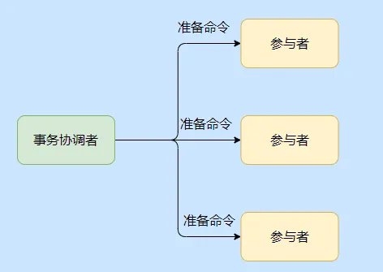
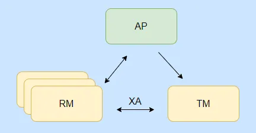

# 分布式事务

常见的分布式事务方案：2PC、3PC、TCC、本地消息、事务消息。

## 2pc

2PC，Two-phase commit protocol，即两阶段提交协议。它引入了一个事务协调者角色，来管理各个参与者（就是各数据库资源）。

整体分为两个阶段，分别是准备阶段和提交/回滚阶段。

我们先来看看第一个阶段，即准备阶段。

由事务协调者给每个参与者发送准备命令，每个参与者收到命令之后会执行相关事务操作，你可以认为除了事务的提交啥都做了。

然后每个参与者会返回响应告知协调者自己是否准备成功。

**协调者收到每个参与者的响应之后就进入第二阶段**，根据收集的响应，如果有一个参与者响应准备失败那么就向所有参与者发送回滚命令，反之发送提交命令。

事务协调者在第一阶段未收到个别参与者的响应，则等待一定时间就会认为事务失败，会发送回滚命令，所以在 2PC 中事务协调者有**超时机制**。

### 优点

**2PC 的优点**是能利用数据库自身的功能进行本地事务的提交和回滚，也就是说提交和回滚实际操作不需要我们实现，不侵入业务逻辑由数据库完成。

### 缺点

**2PC 主要有三大缺点**：同步阻塞、单点故障和数据不一致问题。

#### 同步阻塞

可以看到在第一阶段执行了准备命令后，我们**每个本地资源都处于锁定状态**，因为除了事务的提交之外啥都做了。

所以这时候如果本地的其他请求要访问同一个资源，比如要修改商品表 id 等于 100 的那条数据，那么此时是被阻塞住的，必须等待前面事务的完结，收到提交/回滚命令执行完释放资源后，这个请求才能得以继续。

所以假设这个分布式事务涉及到很多参与者，然后有些参与者处理又特别复杂，特别慢，那么那些处理快的节点也得等着，所以说效率有点低。

#### 单点故障

可以看到这个**单点就是协调者，如果协调者挂了整个事务就执行不下去了**。

如果协调者在发送完准备命令之后挂了，这时候每个本地资源都执行完处于锁定状态了，都杵着了，这就很僵硬了，如果是某个热点资源都阻塞了，这估计就要GG了。**当然这只是协议，具体的落地还是可以变通了**，比如协调者单点问题，我就搞个主从来实现协调者。

#### 数据不一致问题

因为协调者和参与者之间的交流是经过网络的，而网络有时候就会抽风的或者发生局部网络异常。

那么就有可能导致某些参与者无法收到协调者的请求，而某些收到了。比如是提交请求，然后那些收到命令的参与者就提交事务了，此时就产生了数据不一致的问题。

## XA

既然说到 2PC 了那么也简单的提一下 XA 规范，XA 规范是基于两阶段提交的，它实现了两阶段提交协议。

在说 XA 规范之前又得先提一下 DTP 模型，即 Distributed Transaction Processing，这模型规范了分布式事务的模型设计。

而 XA 规范又约束了 DTP 模型中的事务管理器（TM） 和资源管理器（RM）之间的交互，简单的说就是你们两之间要按照一定的格式规范来交流！

我们先来看下 XA 约束下的 DTP 模型。

- AP 应用程序，就是我们的应用，事务的发起者。
- RM 资源管理器，简单的认为就是数据库，具备事务提交和回滚能力，对应我们上面的 2PC 就是参与者。
- TM 事务管理器，就是协调者了，和每个 RM 通信。

简单的说就是 AP 通过 TM 来定义事务操作，TM 和 RM 之间会通过 XA 规范进行通信，执行两阶段提交，而 AP 的资源是从 RM 拿的。

从模型上看有三个角色，而实际实现可以由一个角色实现两个功能，比如 AP 来实现 TM 的功能，TM 没必要抽出来单独部署。

###  mysql XA

知晓了 DTP 之后，我们就来看看 XA 在 MySQL 中是如何操作的，不过只有 InnoDB 支持。

简单的说就是要先定义一个全局唯一的 XID，然后告知每个事务分支要进行的操作。

可以看到图中执行了两个操作，分别是改名字和插入日志，等于先注册下要做的事情，通过 XA START XID 和 XA END XID 来包裹要执行的 SQL。

然后需要发送准备命令，来执行第一阶段，也就是除了事务的提交啥都干了的阶段。

然后根据准备的情况来选择执行提交事务命令还是回滚事务命令。

基本上就是这么个流程，不过 MySQL XA 的性能不高这点是需要注意的。

可以看到虽说 2PC 有缺点，但是还是有基于 2PC 的落地实现的，而 3PC 的引出是为了解决 2PC 的一些缺点，但是它整体下来开销更大，也解决不了网络分区的问题，我也没有找到 3PC 的落地实现。

## 3pc

3PC 的引入是为了解决 2PC 同步阻塞和减少数据不一致的情况。

3PC 也就是多了一个阶段，一个询问的阶段，分别是准备、预提交和提交这三个阶段。

准备阶段单纯就是协调者去访问参与者，类似于你还好吗？能接请求不。

预提交其实就是 2PC 的准备阶段，除了事务的提交啥都干了。

提交阶段和 2PC 的提交一致。

3PC 多了一个阶段其实就是在执行事务之前来确认参与者是否正常，防止个别参与者不正常的情况下，其他参与者都执行了事务，锁定资源。

出发点是好的，但是**绝大部分情况下肯定是正常的，所以每次都多了一个交互阶段就很不划算。**

然后 3PC 在参与者处也引入了超时机制，这样在协调者挂了的情况下，如果已经到了提交阶段了，参与者等半天没收到协调者的情况的话就会自动提交事务。

不过万一协调者发的是回滚命令呢？你看这就出错了，数据不一致了。

还有维基百科上说 2PC 参与者准备阶段之后，如果协调者挂了，参与者是无法得知整体的情况的，因为大局是协调者掌控的，所以参与者相互之间的状况它们不清楚。

而 3PC 经过了第一阶段的确认，即使协调者挂了参与者也知道自己所处预提交阶段是因为已经得到准备阶段所有参与者的认可了。

简单的说就像加了个围栏，使得各参与者的状态得以统一。

### 小结 2PC 和 3PC

从上面已经知晓了 2PC 是一个强一致性的同步阻塞协议，性能已经是比较差的了。

而 3PC 的出发点是为了解决 2PC 的缺点，但是多了一个阶段就多了一次通讯的开销，而且是绝大部分情况下无用的通讯。

虽说引入参与者超时来解决协调者挂了的阻塞问题，但是数据还是会不一致。

可以看到 3PC 的引入并没什么实际突破，而且性能更差了，所以实际只有 2PC 的落地实现。

再提一下，2PC 还是 3PC 都是协议，可以认为是一种指导思想，和真正的落地还是有差别的。

## TCC

不知道大家注意到没，**不管是 2PC 还是 3PC 都是依赖于数据库的事务提交和回滚。**

而有时候一些业务它不仅仅涉及到数据库，可能是发送一条短信，也可能是上传一张图片。

所以说事务的提交和回滚就得提升到业务层面而不是数据库层面了，而 **TCC 就是一种业务层面或者是应用层的两阶段提交**。

TCC 分为指代 Try、Confirm、Cancel ，也就是业务层面需要写对应的三个方法，主要用于跨数据库、跨服务的业务操作的数据一致性问题。

TCC 分为两个阶段，第一阶段是资源检查预留阶段即 Try，第二阶段是提交或回滚，如果是提交的话就是执行真正的业务操作，如果是回滚则是执行预留资源的取消，恢复初始状态。

比如有一个扣款服务，我需要写 Try 方法，用来冻结扣款资金，还需要一个 Confirm 方法来执行真正的扣款，最后还需要提供 Cancel 来进行冻结操作的回滚，对应的一个事务的所有服务都需要提供这三个方法。

可以看到本来就一个方法，现在需要膨胀成三个方法，所以说 TCC 对业务有很大的侵入，像如果没有冻结的那个字段，还需要改表结构。

我们来看下流程。

虽说对业务有侵入，但是 TCC 没有资源的阻塞，每一个方法都是直接提交事务的，如果出错是通过业务层面的 Cancel 来进行补偿，所以也称补偿性事务方法。

这里有人说那要是所有人 Try 都成功了，都执行 Comfirm 了，但是个别 Confirm 失败了怎么办？

这时候只能是不停地重试调失败了的 Confirm 直到成功为止，如果真的不行只能记录下来，到时候人工介入了。

### TCC 的注意点

这几个点很关键，在实现的时候一定得注意了。

**幂等问题**，因为网络调用无法保证请求一定能到达，所以都会有重调机制，因此对于 Try、Confirm、Cancel 三个方法都需要幂等实现，避免重复执行产生错误。

**空回滚问题**，指的是 Try 方法由于网络问题没收到超时了，此时事务管理器就会发出 Cancel 命令，那么需要支持 Cancel  在未执行 Try 的情况下能正常的 Cancel。

**悬挂问题**，这个问题也是指 Try 方法由于网络阻塞超时触发了事务管理器发出了 Cancel 命令，**但是执行了 Cancel 命令之后 Try 请求到了，你说气不气**。

这都 Cancel 了你来个 Try，对于事务管理器来说这时候事务已经是结束了的，这冻结操作就被“悬挂”了，所以空回滚之后还得记录一下，防止 Try 的再调用。

## TCC 变体

上面我们说的是通用型的 TCC，它需要改造以前的实现，但是有一种情况是无法改造的，就是**你调用的是别的公司的接口**。

### 没有 Try 的 TCC

比如坐飞机需要换乘，换乘的又是不同的航空公司，比如从 A 飞到 B，再从 B 飞到 C，只有 A - B 和 B - C 都买到票了才有意义。

这时候的选择就没得 Try 了，直接调用航空公司的买票操作，当两个航空公司都买成功了那就直接成功了，如果某个公司买失败了，那就需要调用取消订票接口。

也就是在第一阶段直接就执行完整个业务操作了，所以要重点关注回滚操作，如果回滚失败得有提醒，要人工介入等。

这其实就是 TCC 的思想。

### 异步 TCC

这 TCC 还能异步？其实也是一种折中，比如某些服务很难改造，并且它又不会影响主业务决策，也就是它不那么重要，不需要及时的执行。

这时候可以引入可靠消息服务，通过消息服务来替代个别服务来进行 Try、Confirm、Cancel 。

Try 的时候只是写入消息，消息还不能被消费，Confirm 就是真正发消息的操作，Cancel 就是取消消息的发送。

这可靠消息服务其实就类似于等下要提到的事务消息，这个方案等于糅合了事务消息和 TCC。

### TCC 小结

可以看到 **TCC 是通过业务代码来实现事务的提交和回滚，对业务的侵入较大，它是业务层面的两阶段提交，**。

它的性能比 2PC 要高，因为不会有资源的阻塞，并且适用范围也大于 2PC，在实现上要注意上面提到的几个注意点。

它是业界比较常用的分布式事务实现方式，而且从变体也可以得知，还是得**看业务变通的，不是说你要用 TCC 一定就得死板的让所有的服务都改造成那三个方法。**

## 最后

可以看到分布式事务还是会有各种问题，一般分布式事务的实现还是只能达到最终一致性。

极端情况下还是得人工介入，所以做好日志记录很关键。

还有编码的业务流程，要往利于公司的方向写，就例如先拿到用户的钱，再给用户东西这个方向，切记。

在上分布式事务之前想想，有没有必要，能不能改造一下避免分布式事务？

再极端一点，考虑下你的业务到底有没有必要上事务。