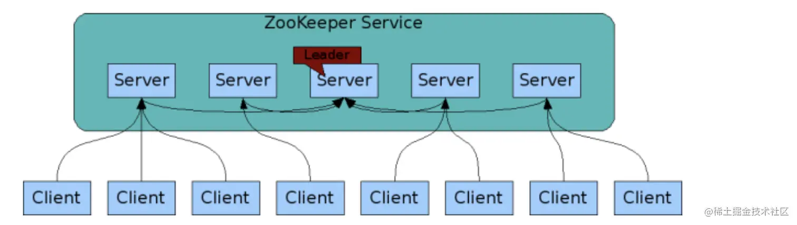
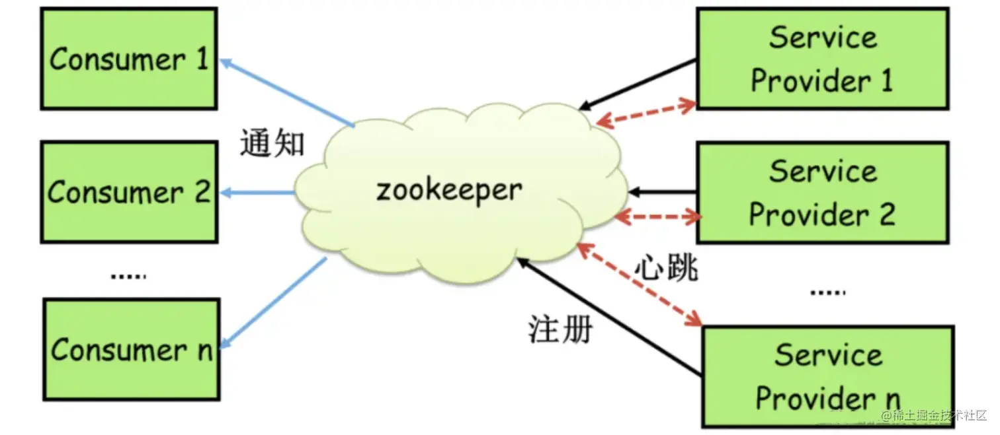
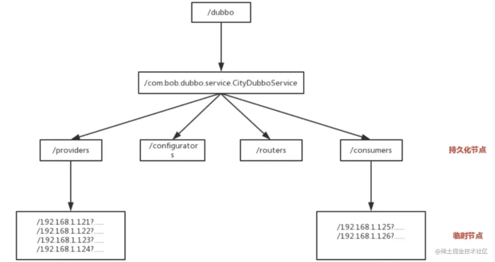
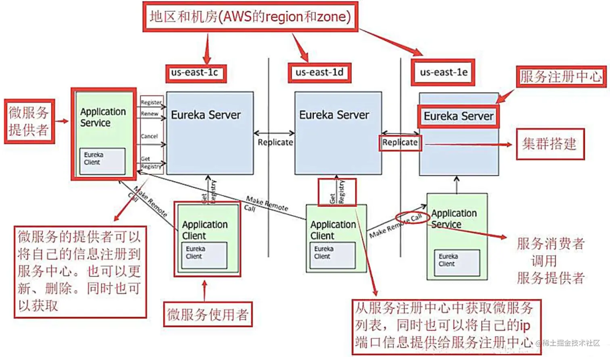
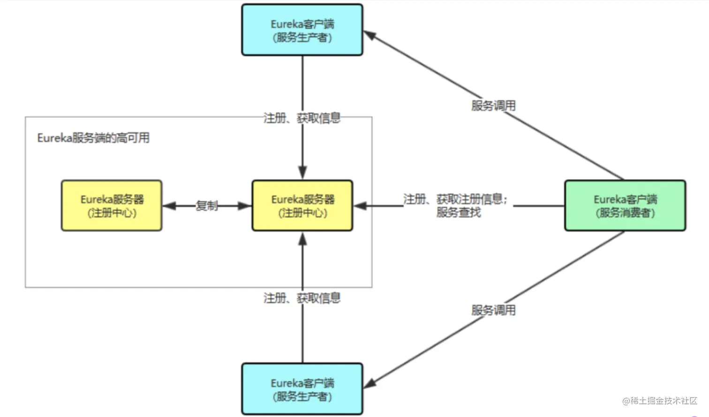
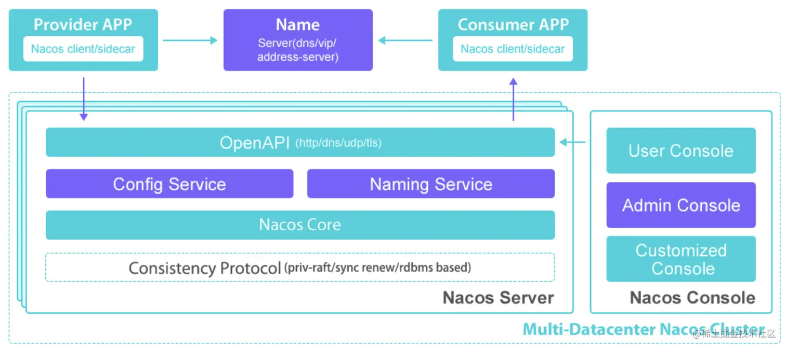
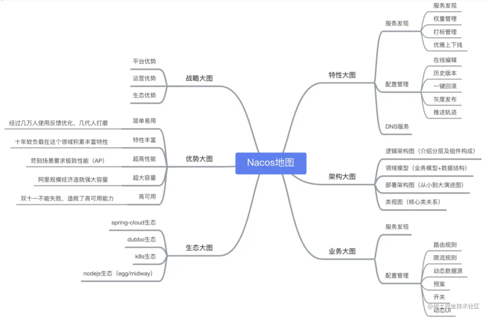
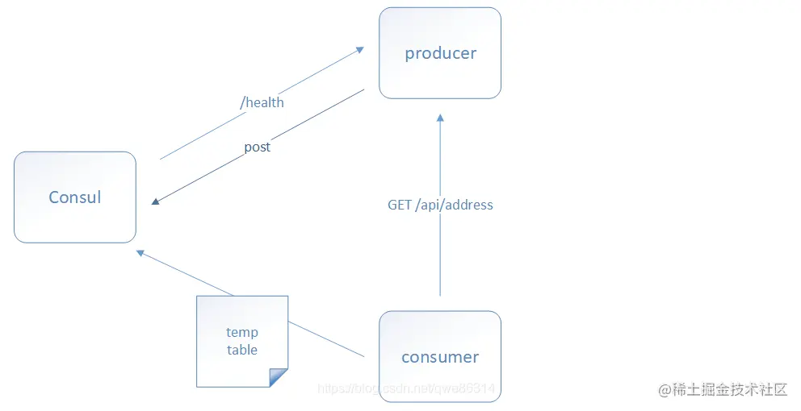
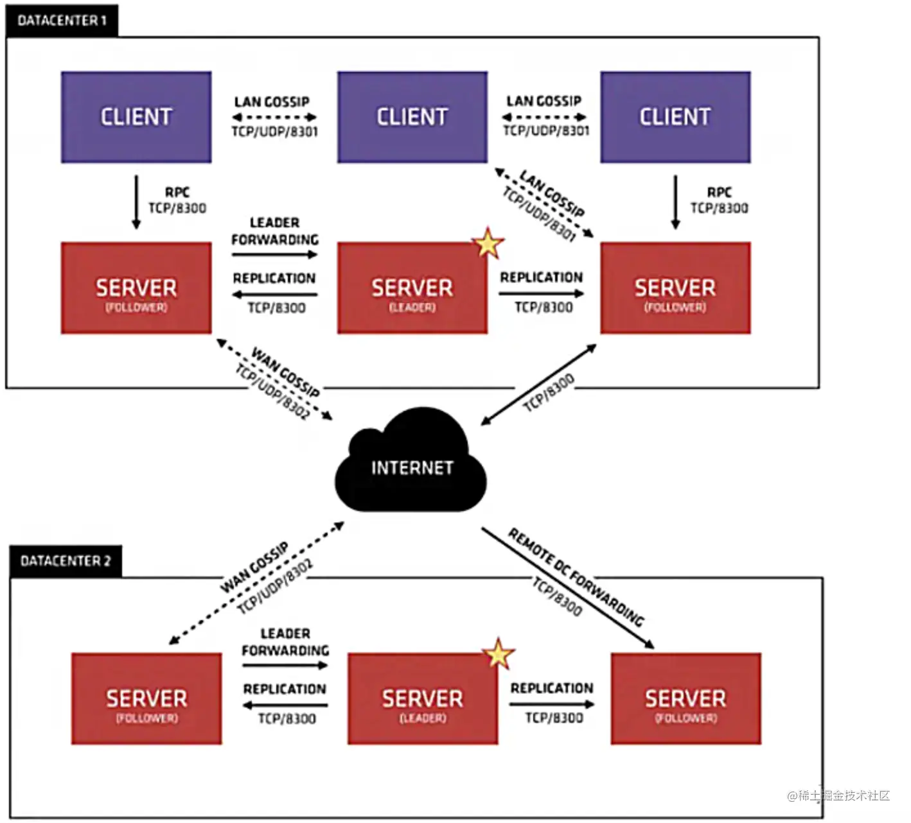
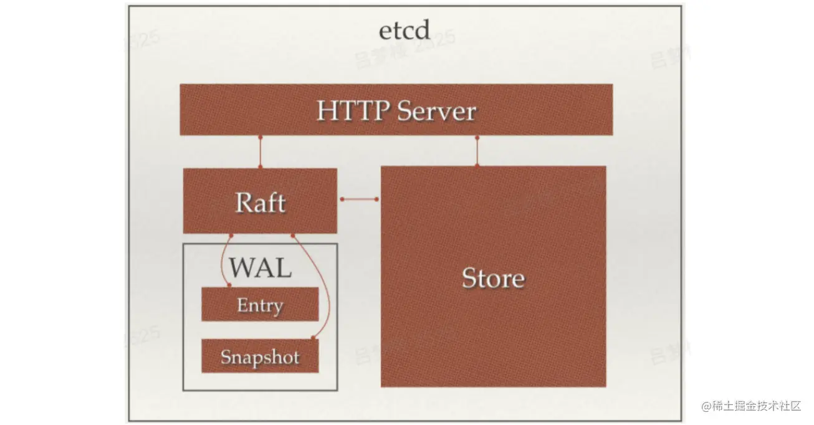

# 常用注册中心

这里主要介绍5种常用的注册中心，分别为**Zookeeper、Eureka、Nacos、Consul和ETCD**。

## Zookeeper

这个说起来有点意思的是官方并没有说他是一个注册中心，但是国内Dubbo场景下很多都是使用Zookeeper来完成了注册中心的功能。

当然这有很多历史原因，这里我们就不追溯了。ZooKeeper是非常经典的服务注册中心中间件，在国内环境下，由于受到Dubbo框架的影响，大部分情况下认为Zookeeper是RPC服务框架下注册中心最好选择，随着Dubbo框架的不断开发优化，和各种注册中心组件的诞生，即使是RPC框架，现在的注册中心也逐步放弃了ZooKeeper。在常用的开发集群环境中，ZooKeeper依然起到十分重要的作用，Java体系中，大部分的集群环境都是依赖ZooKeeper管理服务的各个节点。

### Zookeeper如何实现注册中心

> 具体可参考这篇文章 [《Zookeeper用作注册中心的原理》](https://link.juejin.cn?target=https%3A%2F%2Fmp.weixin.qq.com%2Fs%3F__biz%3DMzg3OTU5NzQ1Mw%3D%3D%26mid%3D2247486840%26idx%3D1%26sn%3D254bb499f1d79a6cc42023f8d143822f%26chksm%3Dcf034f9af874c68cc40e4a7da28ad5302173d876fa0b52808644b9d7f4eec10a13712364ef54%23rd)，下面的内容都出自该文章。

Zookeeper可以充当一个服务注册表（Service Registry），让多个服务提供者形成一个集群，让服务消费者通过服务注册表获取具体的服务访问地址（Ip+端口）去访问具体的服务提供者。如下图所示：

每当一个服务提供者部署后都要将自己的服务注册到zookeeper的某一路径上: /{service}/{version}/{ip:port} 。

比如我们的HelloWorldService部署到两台机器，那么Zookeeper上就会创建两条目录：

- /HelloWorldService/1.0.0/100.19.20.01:16888
- /HelloWorldService/1.0.0/100.19.20.02:16888

这么描述有点不好理解，下图更直观：

在zookeeper中，进行服务注册，实际上就是在zookeeper中创建了一个znode节点，该节点存储了该服务的IP、端口、调用方式(协议、序列化方式)等。该节点承担着最重要的职责，它由服务提供者(发布服务时)创建，以供服务消费者获取节点中的信息，从而定位到服务提供者真正网络拓扑位置以及得知如何调用。

**RPC服务注册/发现过程简述如下：**

1. 服务提供者启动时，会将其服务名称，ip地址注册到配置中心。
2. 服务消费者在第一次调用服务时，会通过注册中心找到相应的服务的IP地址列表，并缓存到本地，以供后续使用。当消费者调用服务时，不会再去请求注册中心，而是直接通过负载均衡算法从IP列表中取一个服务提供者的服务器调用服务。
3. 当服务提供者的某台服务器宕机或下线时，相应的ip会从服务提供者IP列表中移除。同时，注册中心会将新的服务IP地址列表发送给服务消费者机器，缓存在消费者本机。
4. 当某个服务的所有服务器都下线了，那么这个服务也就下线了。
5. 同样，当服务提供者的某台服务器上线时，注册中心会将新的服务IP地址列表发送给服务消费者机器，缓存在消费者本机。
6. 服务提供方可以根据服务消费者的数量来作为服务下线的依据。

zookeeper提供了“心跳检测”功能：**它会定时向各个服务提供者发送一个请求（实际上建立的是一个 socket 长连接），如果长期没有响应，服务中心就认为该服务提供者已经“挂了”，并将其剔除。**

比如100.100.0.237这台机器如果宕机了，那么zookeeper上的路径就会只剩/HelloWorldService/1.0.0/100.100.0.238:16888。

Zookeeper的Watch机制其实就是一种**推拉结合的模式**：

- 服务消费者会去监听相应路径（/HelloWorldService/1.0.0），一旦路径上的数据有任务变化（增加或减少），**Zookeeper只会发送一个事件类型和节点信息给关注的客户端，而不会包括具体的变更内容**，所以事件本身是轻量级的，这就是推的部分。
- **收到变更通知的客户端需要自己去拉变更的数据**，这就是拉的部分。

### Zookeeper不适合作为注册中心

作为一个分布式协同服务，ZooKeeper非常好，但是对于Service发现服务来说就不合适了，因为对于Service发现服务来说就算是返回了包含不实的信息的结果也比什么都不返回要好。**所以当向注册中心查询服务列表时，我们可以容忍注册中心返回的是几分钟以前的注册信息，但不能接受服务直接down掉不可用。**

但是zk会出现这样一种情况，当master节点因为网络故障与其他节点失去联系时，剩余节点会重新进行leader选举。问题在于，选举leader的时间太长，30 ~ 120s, 且选举期间整个zk集群都是不可用的，这就导致在选举期间注册服务瘫痪。在云部署的环境下，因网络问题使得zk集群失去master节点是较大概率会发生的事，虽然服务能够最终恢复，但是漫长的选举时间导致的注册长期不可用是不能容忍的。

所以说，**作为注册中心，可用性的要求要高于一致性！**

在 CAP 模型中，**Zookeeper整体遵循一致性（CP）原则**，即在任何时候对 Zookeeper 的访问请求能得到一致的数据结果，但是当机器下线或者宕机时，**不能保证服务可用性。**

那为什么Zookeeper不使用最终一致性（AP）模型呢？因为这个依赖**Zookeeper的核心算法是ZAB，所有设计都是为了强一致性**。这个对于分布式协调系统，完全没没有毛病，但是**你如果将Zookeeper为分布式协调服务所做的一致性保障，用在注册中心，或者说服务发现场景，这个其实就不合适。**

## Eureka

### Eureka 架构图

什么，上面这幅图看起来很复杂？那我给你贴个简化版：

### Eureka 特点

- **可用性（AP原则）**：Eureka 在设计时就紧遵AP原则，Eureka的集群中，只要有一台Eureka还在，就能保证注册服务可用，只不过查到的信息可能不是最新的（不保证强一致性）。
- **去中心化架构**：Eureka Server 可以运行多个实例来构建集群，不同于 ZooKeeper 的选举 leader 的过程，Eureka Server 采用的是Peer to Peer 对等通信。这是一种去中心化的架构，无 master/slave 之分，每一个 Peer 都是对等的。节点通过彼此互相注册来提高可用性，每个节点需要添加一个或多个有效的 serviceUrl 指向其他节点。每个节点都可被视为其他节点的副本。
- **请求自动切换**：在集群环境中如果某台 Eureka Server 宕机，Eureka Client 的请求会自动切换到新的 Eureka Server 节点上，当宕机的服务器重新恢复后，Eureka 会再次将其纳入到服务器集群管理之中。
- **节点间操作复制**：当节点开始接受客户端请求时，所有的操作都会在节点间进行复制操作，将请求复制到该 Eureka Server 当前所知的其它所有节点中。
- **自动注册&心跳**：当一个新的 Eureka Server 节点启动后，会首先尝试从邻近节点获取所有注册列表信息，并完成初始化。Eureka Server 通过 getEurekaServiceUrls() 方法获取所有的节点，并且会通过心跳契约的方式定期更新。
- **自动下线**：默认情况下，如果 Eureka Server 在一定时间内没有接收到某个服务实例的心跳（默认周期为30秒），Eureka Server 将会注销该实例（默认为90秒， eureka.instance.lease-expiration-duration-in-seconds 进行自定义配置）。
- **保护模式**：当 Eureka Server 节点在短时间内丢失过多的心跳时，那么这个节点就会进入自我保护模式。

除了上述特点，Eureka还有一种自我保护机制，如果在15分钟内超过 **85%** 的节点都没有正常的心跳，那么Eureka就认为客户端与注册中心出现了网络故障，此时会出现以下几种情况：

- Eureka不再从注册表中移除因为长时间没有收到心跳而过期的服务；
- Eureka仍然能够接受新服务注册和查询请求，但是不会被同步到其它节点上（即保证当前节点依然可用）
- 当网络稳定时，当前实例新注册的信息会被同步到其它节点中。

### Eureka工作流程

了解完 Eureka 核心概念，自我保护机制，以及集群内的工作原理后，我们来整体梳理一下 Eureka 的工作流程：

1. Eureka Server 启动成功，等待服务端注册。在启动过程中如果配置了集群，集群之间定时通过 Replicate 同步注册表，每个 Eureka Server 都存在独立完整的服务注册表信息。
2. Eureka Client 启动时根据配置的 Eureka Server 地址去注册中心注册服务。
3. Eureka Client 会每 30s 向 Eureka Server 发送一次心跳请求，证明客户端服务正常。
4. 当 Eureka Server 90s 内没有收到 Eureka Client 的心跳，注册中心则认为该节点失效，会注销该实例。
5. 单位时间内 Eureka Server 统计到有大量的 Eureka Client 没有上送心跳，则认为可能为网络异常，进入自我保护机制，不再剔除没有上送心跳的客户端。
6. 当 Eureka Client 心跳请求恢复正常之后，Eureka Server 自动退出自我保护模式。
7. Eureka Client 定时全量或者增量从注册中心获取服务注册表，并且将获取到的信息缓存到本地。
8. 服务调用时，Eureka Client 会先从本地缓存找寻调取的服务。如果获取不到，先从注册中心刷新注册表，再同步到本地缓存。
9. Eureka Client 获取到目标服务器信息，发起服务调用。
10. Eureka Client 程序关闭时向 Eureka Server 发送取消请求，Eureka Server 将实例从注册表中删除。

> 通过分析 Eureka 工作原理，我可以明显地感觉到 Eureka 的设计之巧妙，完美地解决了注册中心的稳定性和高可用性。
>
> Eureka 为了保障注册中心的高可用性，容忍了数据的非强一致性，服务节点间的数据可能不一致， Client-Server 间的数据可能不一致。**比较适合跨越多机房、对注册中心服务可用性要求较高的使用场景。**

## Nacos

> 以下内容摘抄自Nacos官网：[nacos.io/zh-cn/docs/…](https://link.juejin.cn?target=https%3A%2F%2Fnacos.io%2Fzh-cn%2Fdocs%2Fwhat-is-nacos.html)

Nacos 致力于帮助您发现、配置和管理微服务。Nacos 提供了一组简单易用的特性集，帮助您快速实现动态服务发现、服务配置、服务元数据及流量管理。

Nacos 帮助您更敏捷和容易地构建、交付和管理微服务平台。 Nacos 是构建以“服务”为中心的现代应用架构 (例如微服务范式、云原生范式) 的服务基础设施。

### Nacos 主要特点

**服务发现和服务健康监测**：

- Nacos 支持基于 DNS 和基于 RPC 的服务发现。服务提供者使用原生SDK、OpenAPI、或一个独立的Agent TODO注册 Service 后，服务消费者可以使用DNS TODO 或HTTP&API查找和发现服务。
- Nacos 提供对服务的实时的健康检查，阻止向不健康的主机或服务实例发送请求。Nacos 支持传输层 (PING 或 TCP)和应用层 (如 HTTP、MySQL、用户自定义）的健康检查。 对于复杂的云环境和网络拓扑环境中（如 VPC、边缘网络等）服务的健康检查，Nacos 提供了 agent 上报模式和服务端主动检测2种健康检查模式。Nacos 还提供了统一的健康检查仪表盘，帮助您根据健康状态管理服务的可用性及流量。

**动态配置服务**：

- 动态配置服务可以让您以中心化、外部化和动态化的方式管理所有环境的应用配置和服务配置。
- 动态配置消除了配置变更时重新部署应用和服务的需要，让配置管理变得更加高效和敏捷。
- 配置中心化管理让实现无状态服务变得更简单，让服务按需弹性扩展变得更容易。
- Nacos 提供了一个简洁易用的UI (控制台样例 Demo) 帮助您管理所有的服务和应用的配置。Nacos 还提供包括配置版本跟踪、金丝雀发布、一键回滚配置以及客户端配置更新状态跟踪在内的一系列开箱即用的配置管理特性，帮助您更安全地在生产环境中管理配置变更和降低配置变更带来的风险。

**动态 DNS 服务**：

- 动态 DNS 服务支持权重路由，让您更容易地实现中间层负载均衡、更灵活的路由策略、流量控制以及数据中心内网的简单DNS解析服务。动态DNS服务还能让您更容易地实现以 DNS 协议为基础的服务发现，以帮助您消除耦合到厂商私有服务发现 API 上的风险。
- Nacos 提供了一些简单的 DNS APIs TODO 帮助您管理服务的关联域名和可用的 IP:PORT 列表。

> 小节一下：
>
> - Nacos是阿里开源的，支持基于 DNS 和基于 RPC 的服务发现。
> - **Nacos的注册中心支持CP也支持AP**，对他来说只是一个命令的切换，随你玩，还支持各种注册中心迁移到Nacos，反正一句话，只要你想要的他就有。
> - **Nacos除了服务的注册发现之外，还支持动态配置服务**，一句话概括就是**Nacos = Spring Cloud注册中心 + Spring Cloud配置中心**。

## Consul

Consul 是 HashiCorp 公司推出的开源工具，用于实现分布式系统的服务发现与配置。与其它分布式服务注册与发现的方案，Consul 的方案更“一站式”，内置了服务注册与发现框 架、分布一致性协议实现、健康检查、Key/Value 存储、多数据中心方案，不再需要依赖其它工具（比如 ZooKeeper 等）。

Consul 使用起来也较为简单，使用 Go 语言编写，因此具有天然可移植性(支持Linux、windows和Mac OS X)；安装包仅包含一个可执行文件，方便部署，与 Docker 等轻量级容器可无缝配合。

### Consul 的调用过程

1. 当 Producer 启动的时候，会向 Consul 发送一个 post 请求，告诉 Consul 自己的 IP 和 Port；
2. Consul 接收到 Producer 的注册后，每隔 10s（默认）会向 Producer 发送一个健康检查的请求，检验 Producer 是否健康；
3. 当 Consumer 发送 GET 方式请求 /api/address 到 Producer 时，会先从 Consul 中拿到一个存储服务 IP 和 Port 的临时表，从表中拿到 Producer 的 IP 和 Port 后再发送 GET 方式请求 /api/address；
4. 该临时表每隔 10s 会更新，只包含有通过了健康检查的 Producer。

### Consul 主要特征

- CP模型，使用 Raft 算法来保证强一致性，不保证可用性；
- 支持服务注册与发现、健康检查、KV Store功能。
- 支持多数据中心，可以避免单数据中心的单点故障，而其部署则需要考虑网络延迟, 分片等情况等。
- 支持安全服务通信，Consul可以为服务生成和分发TLS证书，以建立相互的TLS连接。
- 支持 http 和 dns 协议接口；
- 官方提供 web 管理界面。

### 多数据中心

> 这里纯属了解，学习一下 Consul 的多数据中心是如何实现的。

Consul支持开箱即用的多数据中心，这意味着用户不需要担心需要建立额外的抽象层让业务扩展到多个区域。

在上图中有两个DataCenter，他们通过Internet互联，同时请注意为了提高通信效率，只有Server节点才加入跨数据中心的通信。

在单个数据中心中，Consul分为Client和Server两种节点（所有的节点也被称为Agent），Server节点保存数据，Client负责健康检查及转发数据请求到Server；Server节点有一个Leader和多个Follower，Leader节点会将数据同步到Follower，Server的数量推荐是3个或者5个，在Leader挂掉的时候会启动选举机制产生一个新的Leader。

集群内的Consul节点通过gossip协议（流言协议）维护成员关系，也就是说某个节点了解集群内现在还有哪些节点，这些节点是Client还是Server。单个数据中心的流言协议同时使用TCP和UDP通信，并且都使用8301端口。跨数据中心的流言协议也同时使用TCP和UDP通信，端口使用8302。

集群内数据的读写请求既可以直接发到Server，也可以通过Client使用RPC转发到Server，请求最终会到达Leader节点，在允许数据延时的情况下，读请求也可以在普通的Server节点完成，集群内数据的读写和复制都是通过TCP的8300端口完成。

## ETCD

etcd是一个Go言编写的分布式、高可用的一致性键值存储系统，用于提供可靠的分布式键值存储、配置共享和服务发现等功能。

### ETCD 特点

- 易使用：基于HTTP+JSON的API让你用curl就可以轻松使用；
- 易部署：使用Go语言编写，跨平台，部署和维护简单；
- 强一致：使用Raft算法充分保证了分布式系统数据的强一致性；
- 高可用：具有容错能力，假设集群有n个节点，当有(n-1)/2节点发送故障，依然能提供服务；
- 持久化：数据更新后，会通过WAL格式数据持久化到磁盘，支持Snapshot快照；
- 快速：每个实例每秒支持一千次写操作，极限写性能可达10K QPS；
- 安全：可选SSL客户认证机制；
- ETCD 3.0：除了上述功能，还支持gRPC通信、watch机制。

### ETCD 框架

etcd主要分为四个部分：

- HTTP Server：用于处理用户发送的API请求以及其它etcd节点的同步与心跳信息请求。
- Store：用于处理etcd支持的各类功能的事务，包括数据索引、节点状态变更、监控与反馈、事件处理与执行等等，是etcd对用户提供的大多数API功能的具体实现。
- Raft：Raft强一致性算法的具体实现，是etcd的核心。
- WAL：Write Ahead Log（预写式日志），是etcd的数据存储方式。除了在内存中存有所有数据的状态以及节点的索引以外，etcd就通过WAL进行持久化存储。WAL中，所有的数据提交前都会事先记录日志。Snapshot是为了防止数据过多而进行的状态快照；Entry表示存储的具体日志内容。

通常，一个用户的请求发送过来，会经由HTTP Server转发给Store进行具体的事务处理，如果涉及到节点的修改，则交给Raft模块进行状态的变更、日志的记录，然后再同步给别的etcd节点以确认数据提交，最后进行数据的提交，再次同步。

更多关于ETCD相关知识，可以查看该文章 [《肝了一个月的ETCD，从Raft原理到实践》](https://link.juejin.cn?target=https%3A%2F%2Fmp.weixin.qq.com%2Fs%3F__biz%3DMzg3OTU5NzQ1Mw%3D%3D%26mid%3D2247485759%26idx%3D1%26sn%3D41957e94a2c69426befafd373fbddcc5%26chksm%3Dcf034bddf874c2cb52a7aafea5cd194e70308c7d4ad74183db8a36d3747122be1c7a31b84ee3%26token%3D179167416%26lang%3Dzh_CN%23rd)

# 注册中心对比&选型

## 注册中心对比

 

- **服务健康检查**：Euraka 使用时需要显式配置健康检查支持；Zookeeper、Etcd 则在失去了和服务进程的连接情况下任务不健康，而 Consul 相对更为详细点，比如内存是否已使用了90%，文件系统的空间是不是快不足了。

- **多数据中心**：Consul 和 Nacos 都支持，其他的产品则需要额外的开发工作来实现。

- **KV 存储服务**：除了 Eureka，其他几款都能够对外支持 k-v 的存储服务，所以后面会讲到这几款产品追求高一致性的重要原因。而提供存储服务，也能够较好的转化为动态配置服务哦。

- CAP 理论的取舍

  ：

  - Eureka 是典型的 AP，Nacos可以配置为 AP，作为分布式场景下的服务发现的产品较为合适，服务发现场景的可用性优先级较高，一致性并不是特别致命。
  - 而Zookeeper、Etcd、Consul则是 CP 类型牺牲可用性，在服务发现场景并没太大优势；

- **Watch的支持**：Zookeeper 支持服务器端推送变化，其它都通过长轮询的方式来实现变化的感知。

- **自身集群的监控**：除了Zookeeper和Nacos，其它几款都默认支持 metrics，运维者可以搜集并报警这些度量信息达到监控目的。

- **Spring Cloud的集成**：目前都有相对应的 boot starter，提供了集成能力。

## 注册中心选型

关于注册中心的对比和选型，其实上面已经讲的非常清楚了，我给出一些个人理解：

- **关于CP还是AP的选择**：选择 AP，因为可用性高于一致性，所以更倾向 Eureka 和 Nacos；关于Eureka、Nacos如何选择，哪个让我做的事少，我就选择哪个，显然 Nacos 帮我们做了更多的事。
- **技术体系**：Etcd 和 Consul 都是Go开发的，Eureka、Nacos、Zookeeper 和 Zookeeper 都是Java开发的，可能项目属于不同的技术栈，会偏向选择对应的技术体系。
- **高可用**：这几款开源产品都已经考虑如何搭建高可用集群，有些差别而已；
- **产品的活跃度**：这几款开源产品整体上都比较活跃。