# 20张图带你搞懂hppts

## 不安全的 HTTP

近些年来，越来越多的网站使用 HTTPS 协议进行数据传输，原因在于 HTTPS 相较于 HTTP 能够提供更加安全的服务。

很多浏览器对于使用 HTTP 协议的网站会加上『警告』的标志表示数据传输不安全，而对于使用 HTTPS 协议的网站会加上一把『锁』标志表示数据传输安全。

为什么 HTTP 协议不安全呢？主要表现在以下三个方面：

- **容易被窃听**：HTTP 传输的数据是**明文**。黑客很容易通过嗅探技术截获报文，由于数据没有加密，内容可以被黑客所理解。

  举个例子：如果用户输入密码取款，那么黑客窃听了此密码后，就可以为所欲为了！

- **容易被篡改**：黑客可以在截获 HTTP 报文后，对报文进行修改，然后再发送到目的地。

  举个例子：如果用户想要转账给家人，而黑客将收款人修改成了自己，将会造成用户出现损失！

- **容易被伪造身份**：黑客可以伪造 HTTP 报文，假装自己是用户真正想要访问的网站，然后与用户进行通信。

  举个例子：如果用户想要访问淘宝网站进行购物，而黑客冒充自己是淘宝网站，用户就可能在此假淘宝网站上买东西，造成损失！

HTTPS 是如何解决以上安全性问题的呢？主要方法如下所示：

- **数据加密**：HTTPS 传输的不再是**明文**，而是采用加密算法传输**密文**，黑客即使截获了报文，也无法理解内容！
- **完整性摘要**：HTTPS 通过摘要算法得到报文的一个摘要，如果黑客篡改了报文内容，那么重新生成的摘要将发生变化，接收方校验后就知道数据不再完整，被篡改了！
- **数字证书**：HTTPS 通过数字证书来验证通信实体的身份，而黑客因为没有相应的证书，一旦冒充其他网站将会被识破！

## 加密算法

> 加密算法用于解决 HTTP 传输数据容易被窃听的问题。

为了防止传输数据被黑客所窃听，客户端与服务器之间需要对数据进行**加解密**处理。

发送方使用**加密算法**将`明文`加密为`密文`，而接收方使用相应的**解密算法**将`密文`解密为`明文`。黑客只能看到`密文`，因而并不能获取到任何有用信息。如下图所示：

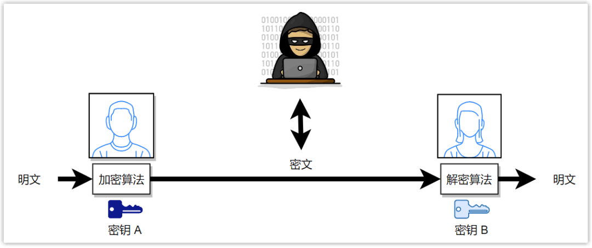

一般来说，加密算法分为两大类，**对称加密**和**非对称加密**。

- **对称加密**：指加密和解码使用同一把密钥，即图中的密钥 A 等于密钥 B；
- **非对称加密**：指加密和解密使用不同的密钥，即图中的密钥 A 不等于密钥 B。

### 对称加密

对称加密算法中加密和解密的钥匙是同一把，称之为**密钥**。

**凯撒密码**是一种较为简单的对称加密算法，可用于对英语文本进行加解密。其主要思想是：将明文中的每个字母按照字母表所在位置右移 K 位，得到密文（允许回绕）。

举个例子，设 K = 2，那么明文中的字母 "a" 用字母 "c" 代替，字母 "z" 用 字母 "b" 代替。此时 K = 2 就是对称加密算法中的密钥。

这种方式的缺点在于：每个字母经过加密后只有唯一的密文表示，如果黑客收集了很多数据后进行统计分析，很可能就破解了加密手段。

更好的方式是采用多个凯撒密码 K 轮询进行加密，比如位置为奇数的字母采用密钥 K = 2 加密，位置为偶数的字母采用密钥 K = 3 加密。

然而凯撒密码只能加密英文文本，若想要加密所有字符，可以采用**分组加密**的方式。

我们知道任何数据在计算机中实际存储的是 0/1 比特的组合。**分组加密**的主要思想是：将要加密的报文处理为 K 比特的分组，每个分组通过一对一的映射表进行加密。

举个例子，设 K = 3，映射表如下图，那么报文 010110001111 将会被加密为 101000111001。此时 K=3 以及映射表就是对称加密算法中的密钥。

与前面采用多个凯撒密码 K 作为密钥的方式一样，为了增加破解的难度，一种更好的方式是采用多个映射表，轮询对数据进行加密。

计算机网络中常用的对称加密算法有：**DES、3DES、AES** 等，都属于分组加密算法。

### 非对称加密

非对称加密算法中加密和解密的钥匙不同，分别称为**公钥**和**私钥**。其特点在于：

- 如果用公钥加密，则只能用私钥解密，此时公钥是不能解密的。
- 如果用私钥加密，则只能用公钥解密，此时私钥是不能解密的。
- 公钥是对外公开的，任何人都能够得到；私钥只有自己知道，不能泄露。

为什么有了对称加密后还会出现非对称加密呢？

原因在于对称加密的前提是**通信双方需要商量出一个密钥**，而商量密钥的时候传输的是明文，如果此密钥被黑客所截获，即使后面的报文进行了加密，黑客也可以通过此密钥进行解密！

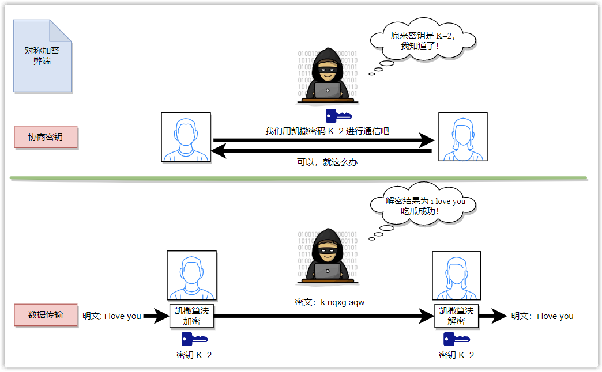

非对称加密的一个特点是：**公钥加密，只有私钥可以解密**。那么就无需像对称加密那样提前协商好密钥。通信双方可以直接将自己的公钥发送给另一方，这个公钥即使黑客知道也无所谓，当一方用此公钥加密后，即使黑客截获了报文，也无法用公钥解密，只有拥有私钥的另一方才能解密成功！

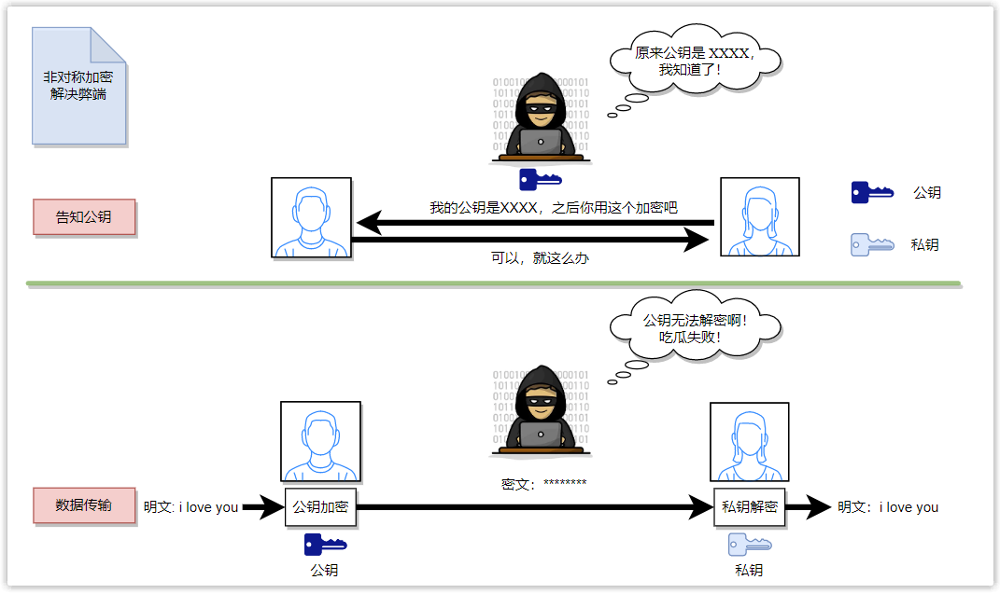

计算机网络中常用的非对称加密算法有：**RSA、 ECDHE** 等。

相较于对称加密，非对称加密算法更加复杂难懂，数学推理较多，如果对具体算法感兴趣的，可以看一下阮一峰的两篇文章：RSA 算法原理（一）和 RSA 算法原理（二）。

https://www.ruanyifeng.com/blog/2013/06/rsa_algorithm_part_one.html

http://www.ruanyifeng.com/blog/2013/07/rsa_algorithm_part_two.html

### 混合加密

前面提到，对称加密算法需要提前协商出密钥，而协商的过程用的是明文（因为还没有密钥），如果黑客截获了明文密钥，那么之后即使加密了，黑客也可以用密钥进行解密，此时就无安全性可言了！

非对称加密算法解决了此问题，但是其存在大量的指数运算，加密速度非常慢！而对称加密算法的加密速度非常快，一般是非对称加密算法的 100-10000 倍！

那能不能将二者综合起来，使得数据传输不仅安全且高效呢？答案是肯定的！**HTTPS 采用混合加密方式，既采用对称加密，也采用非对称加密。**

对称加密算法的弱点在于协商密钥的过程采用明文不安全，存在密钥泄漏的可能，那么我们是不是可以不采用明文，而是采用非对称加密算法来协商此密钥，之后传输数据时再采用对称加密算法进行加密。

也就是说，**用非对称加密算法传输密钥，用对称加密算法传输实际数据。**此密钥一般称为`『会话密钥』`。

- 会话密钥通过非对称加密算法传输，非常`安全`；
- 大量数据通过对称加密算法传输（多次），会话密钥只需要传一次，非常`高效`！

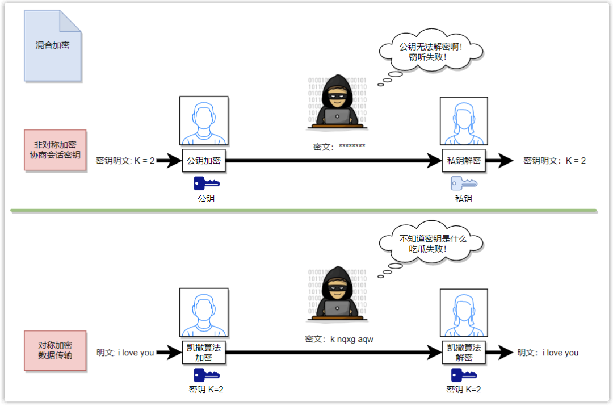

## 摘要算法

> 摘要算法用于解决 HTTP 传输数据容易被篡改的问题。

摘要算法也称为哈希算法，其**输入为任意数据，输出为固定长度的字符串（称为摘要）**。主要特点如下：

- 不可逆，即无法通过输出反推输入。
- 相同的输入必会产生相同的输出。
- 不同的输入大概率会产生不同的输出。
- 无论输入的数据有多长，输出摘要的长度固定不变。

举个例子：如果将数据的比特流每 8 个比特进行分组（不足的补零），然后将所有分组进行按位`异或运算`，那么生成的结果就可以称为摘要，此算法就是一种简单的摘要算法。

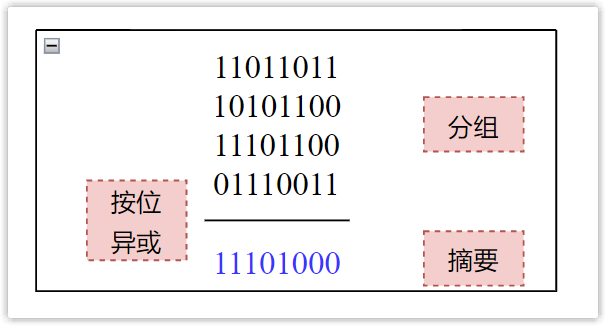

如果两个输入数据经过摘要算法得到的输出摘要一致，则称为出现了**哈希碰撞**。一个好的摘要算法出现哈希碰撞的概率非常低，而且非常难以通过输出猜测输入的内容！

计算机网络中常用的摘要算法有：**MD5、SHA-1、SHA-256** 等。

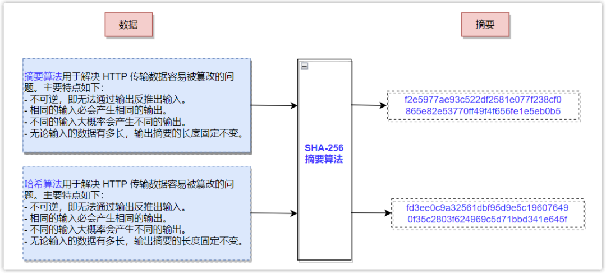

为了防止传输数据被黑客所篡改，发送方除了发送实际数据外，还利用摘要算法得到数据的一个`摘要`，并将此摘要一并发送。

接收方收到数据后，利用同样的摘要算法再次得到数据的`摘要`，并将其与发送方发送的`摘要`进行比对校验，如果二者不一致，则说明数据被篡改了，反之则没有。

小伙伴们很容易看出来上述方式存在明显缺陷，如果黑客不仅篡改了数据，而且同时篡改了摘要，接收方不就无法判断数据是否被篡改了吗？

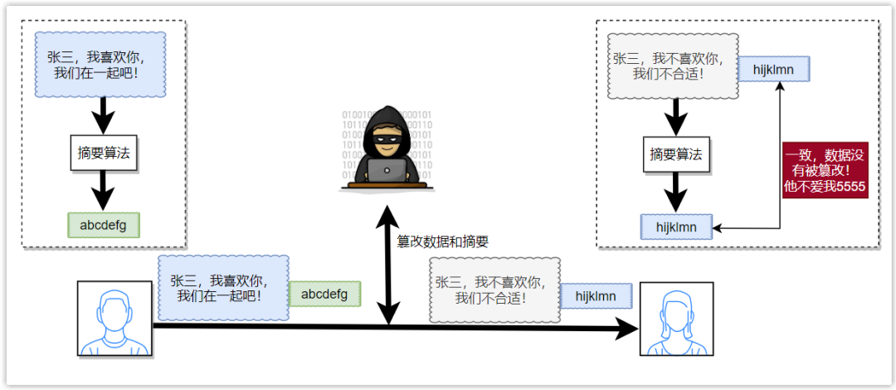

为了防止这种情况的发生，发送方与接收方必须有一个只有二者知道的，而黑客不能知道的东西，比如对称加密的`会话密钥`。不过为了提升安全性，此时一般不使用会话密钥，而是使用一个新的密钥，称之为`鉴别密钥`，这个密钥的获取同会话密钥。

有了`鉴别密钥`后，摘要算法的输入就不仅仅是传输数据了，而是传输数据和鉴别密钥！黑客由于不知道鉴别密钥，就无法再伪造输入，篡改的摘要也就不正确了，从而保证了安全性！

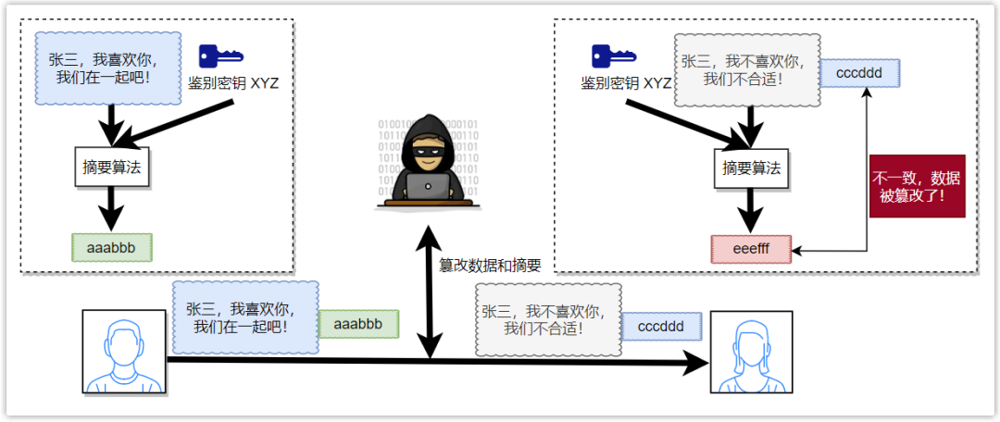

数据和鉴别密钥级联后经过摘要算法所生成的摘要有个专用名字，称为**报文鉴别码**，简称 **MAC**。

为了进一步提升安全性，实际上客户端和服务器将使用不同的`会话密钥`和`鉴别密钥`，也就是一共需要四个密钥：

1. 用于从客户端发送到服务器的数据的`会话密钥`；
2. 用于从服务器发送到客户端的数据的`会话密钥`；
3. 用于从客户端发送到服务器的数据的`鉴别密钥`；
4. 用于从服务器发送到客户端的数据的`鉴别密钥`。

## 数字证书

> 数字证书用于解决 HTTP 协议中身份容易被伪造的问题。

前面提到 HTTPS 采用非对称加密算法传输`会话密钥`。一般是服务器将公钥对外公布，客户端利用此公钥加密`会话密钥`，然后服务器通过私钥解密得到`会话密钥`，此时双方即协商好了用于对称加密传输数据的密钥。

但是万一服务器的公钥是被黑客伪造的呢？比如经典的『中间人攻击』问题：

1. 客户端发送的请求被中间人（黑客）劫持（如使用 DNS 劫持），所有请求均发送至中间人。
2. 中间人假装自己是正规网站（服务器），向客户端返回自己的公钥 2 ，并索要正规网站的公钥 1。
3. 客户端使用中间人的公钥 2 加密`会话密钥1`，并发送至中间人。
4. 中间人使用自己的私钥 2 解密得到`会话密钥1`，同时假装自己是客户端，使用正规网站的公钥 1 加密`会话密钥2`（可以与会话密钥 1 相同）并发送至正规网站。
5. 客户端使用`会话密钥1`对数据进行加密，并发送至中间人。
6. 中间人使用`会话密钥1`对数据进行解密，得到明文数据！（实现了窃听）
7. 中间人使用`会话密钥2`对数据（可能是篡改的）进行加密，并发送至正规网站。

此时，客户端与服务器的通信再无安全性可言！中间人不仅能够窃听到消息内容，还能够进行篡改！

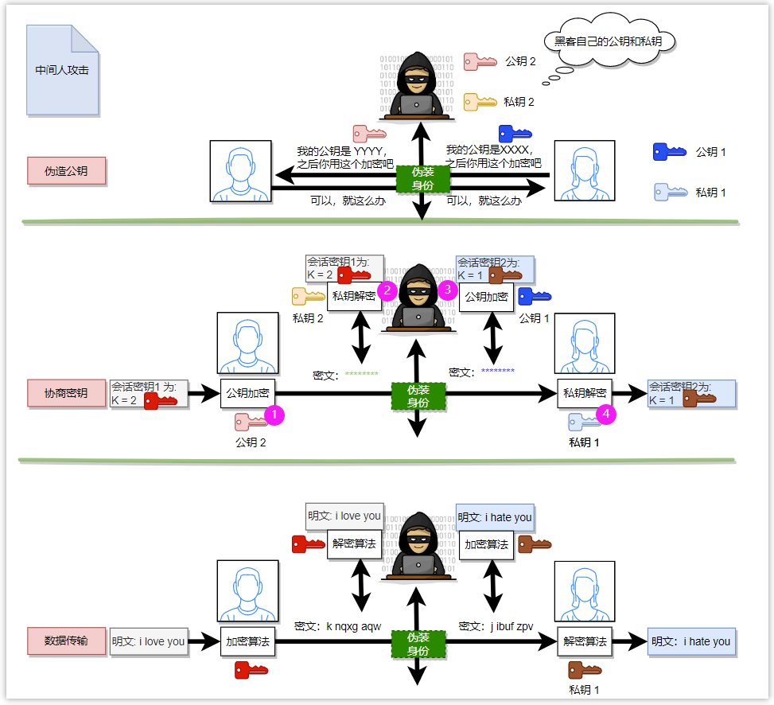

客户端如何知道自己所拥有的公钥是来自于正规网站而不是中间人呢？这时候就需要**数字证书**了！

数字证书的概念就像是我们的身份证一样，专门用于验证通信实体的身份。咱们的身份证是去派出所申请的，而数字证书则需要向**认证中心**（Certification Authority，CA）申请，而且是需要收费的！

通过数字证书解决中间人攻击的具体过程为：

- 服务器（正规网站）首先生成一对公钥和私钥，然后将域名、申请者、公钥（注意不是私钥，私钥是无论如何也不能泄露的）等信息整合在一起，生成 .csr 文件，并将此文件发给认证中心 CA。
- CA 收到申请后，会通过各种手段验证申请者的信息，如无异常，则**使用摘要算法得到 .csr 中明文信息的一个摘要，再用 CA 自己的`私钥`对这个摘要进行加密，生成一串密文，密文也称为数字签名。数字证书即包含此数字签名和 .csr 中明文信息。CA 把这个证书返回给申请人。**
- 为了防止中间人攻击，客户端要求服务器发送其证书，并进行验证。
- 客户端在验证证书时，把证书里的签名与及明文信息分别取出来，然后会**用自身携带的 CA 机构的`公钥`去解密签名，得到摘要 1，再利用摘要算法得到明文信息的摘要 2，对比摘要 1 和摘要 2，如果一样，说明证书是合法的，也就是证书里的公钥是正确的，否则说明证书不合法。**

浏览器如何得到认证中心的公钥呢？万一此公钥是被伪造的呢？为了防止套娃，实际电脑**操作系统中会内置这些认证中心的公钥**！因而无需担心认证中心公钥被伪造的问题。

Chrome 浏览器一旦发现一个网站数字证书无效，就会生成如下界面进行提示，如果用户强制访问，则存在一定的风险。

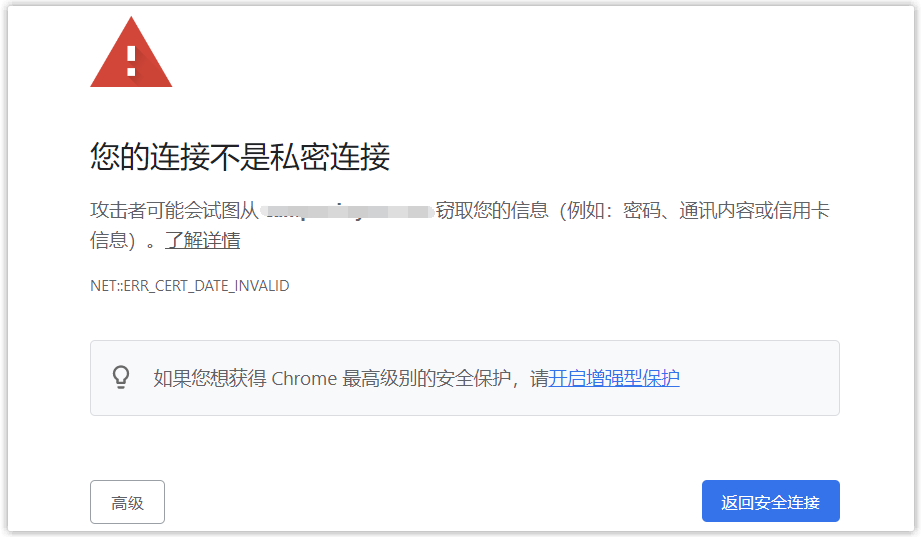

## SSL/TLS 握手

根据前面所述，进行一下小结：

- HTTPS 通过混合加密算法解决 HTTP 传输数据容易被窃听的问题，此过程需要协商`会话密钥`。
- HTTPS 通过摘要算法解决 HTTP 传输数据容易被篡改的问题，此过程需要协商`鉴别密钥`。
- HTTPS 通过数字证书解决 HTTP 协议中身份容易被伪造的问题，此过程需要客户端验证服务器的`证书`。

那么 HTTPS 具体是怎么做的呢？通信双方在什么时候协商`会话密钥`和`鉴别密钥`、什么时候验证`证书`合法性的呢？答案是 SSL/TLS 协议握手的时候。

HTTPS 比 HTTP 多的那个『S』就是指 SSL/TLS 协议。

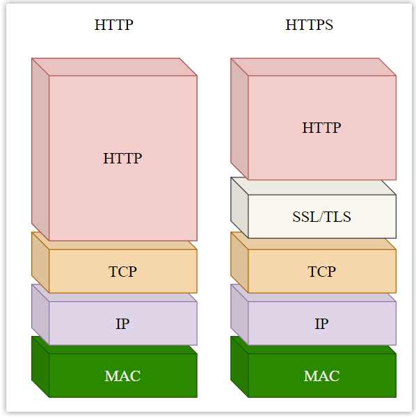

在 HTTPS 协议中，当客户端与服务器通过三次握手建立 TCP 连接之后，并不会直接传输数据，而是先会经过一个 SSL/TLS 握手的过程，用于协商`会话密钥`、`鉴别密钥`以及验证证书等，之后就可以安全传输数据了！

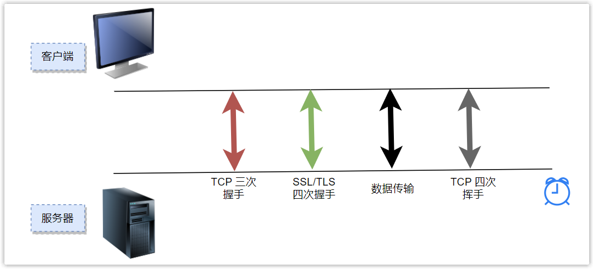

下面通过 Wireshark 抓包，具体讲一下 SSL/TLS 1.2 四次握手的过程。

### 第一次握手

客户端向服务器发起加密通信请求 ，内容主要包括：

1. 客户端支持的 SSL/TLS 协议版本，如 TLS 1.2 版本。
2. 客户端生产的随机数 1，用于后续生成`会话密钥`和`鉴别密钥`。
3. 客户端支持的密码套件列表，每个密码套件包含：
4. `用于传输会话密钥的非对称加密算法`，如 ECDHE、RSA；
5. `用于验证数字证书的非对称加密算法`，如 ECDHE、RSA；
6. `用于传输数据的对称加密算法`，如 AES_128_GCM、AES_128_CBC；
7. `用于验证报文完整性的摘要算法`，如 SHA256、SHA384；
8. 格式为：**TLS_非对称加密算法_非对称加密算法_对称加密算法_摘要算法**，如果两个非对称加密算法一致，可省略不写。

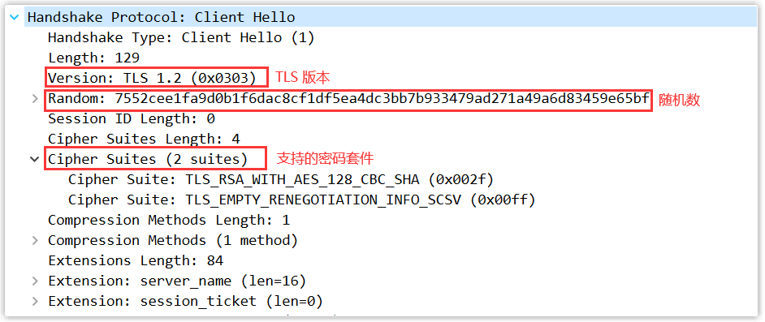

### 第二次握手

服务器收到客户端加密通信请求后，向客户端发出响应，内容主要包括：

1. 确认的 SSL/ TLS 协议版本，如果双方支持的版本不同，则关闭加密通信。
2. 服务器生产的随机数 2，用于后续生成`会话密钥`和`鉴别密钥`。
3. 确认的密码套件，如 TLS_RSA_WITH_AES128_CBC_SHA。
4. 服务器的数字证书。

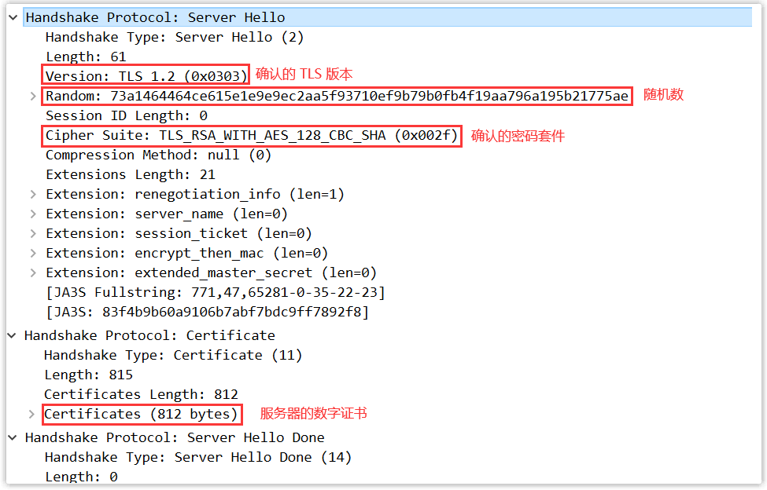

### 第三次握手

客户端收到服务器的回应之后，会验证其数字证书是否合法（验证方法在数字证书小节中有说明），如果证书合法，则进行第三次握手，内容主要包括：

1. 客户端生产的另一个随机数 3（称为前主密钥，Pre-Master Secret，简写为 PMS），此随机数会被服务器`公钥`加密。

   客户端根据随机数 1、随机数 2 以及前主密钥计算出主密钥（Master Secret，MS），接着将主密钥切片得到两个`会话密钥`和两个`鉴别密钥`。

2. 加密通信算法改变通知，表示之后数据都将用`会话密钥`进行加密。

3. 客户端握手结束通知，表示客户端的握手阶段已经结束。客户端会生成所有握手报文数据的摘要，并用`会话密钥`加密后发送给服务器，用来供服务端校验。

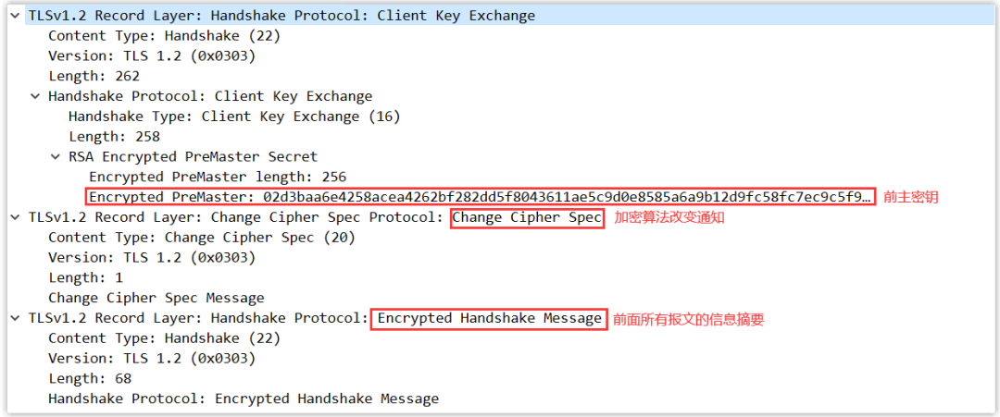

### 第四次握手

服务器收到客户端的消息后，利用自己的`私钥`解密出前主密钥，并根据随机数 1、随机数 2 以及前主密钥计算出主密钥，接着将主密钥切片得到两个`会话密钥`和两个`鉴别密钥`。

之后进行第四次握手，内容主要包括：

1. 加密通信算法改变通知，表示之后数据都将用`会话密钥`进行加密。
2. 服务器握手结束通知，表示服务器的握手阶段已经结束。服务器会生成所有握手报文数据的摘要，并用`会话密钥`加密后发送给客户端，用来供客户端校验。

至此，整个 SSL/TLS 的握手阶段全部结束！

为什么第三、第四次握手要发送所有握手报文的摘要呢？

主要原因是**防止握手信息被篡改**。比如客户端支持的密码套件列表中，有些加密算法较弱，有些加密算法较强，而此密码套件是明文传输的，万一黑客将此密码套件列表进行了修改，只留下一些安全性较低的加密算法，那么服务器就只能从这些安全性较低的加密算法中选择，安全性大大降低。因此需要通过发送摘要的形式防止握手信息被篡改。

为什么不直接发送一个主密钥，而是用两个随机数加一个前主密钥重新生成一个主密钥呢？

主要原因是**防止连接重放**。如果没有前面两个随机数，仅仅由客户端生成一个主密钥，并通过服务器`公钥`加密发送给服务器。那么黑客在嗅探了服务器与客户端之间的所有报文后，可以再次冒充客户端向服务器发送相同的报文（虽然黑客不知道内容是什么），因为报文信息都是之前客户端和服务器验证过的，因此服务器会认为是客户端与其通信，导致又一次连接。

假如服务器是一个购物网站，那么此连接重放会导致客户端再一次下单，造成损失。

而如果有了前两个随机数，即使黑客冒充客户端想要连接重放，然而**由于随机数不同，生成的密钥则不同**，黑客重新发送的内容将失效（服务器不能理解、完整性摘要也不对）。

最后，用一张图总结 TLS 四次握手的过程。

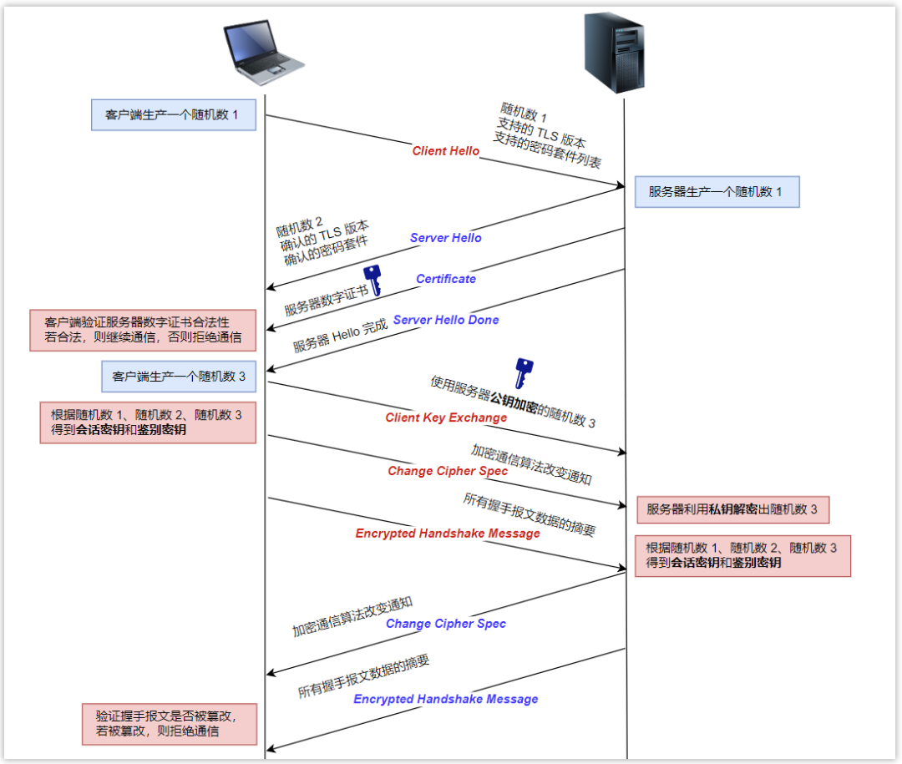