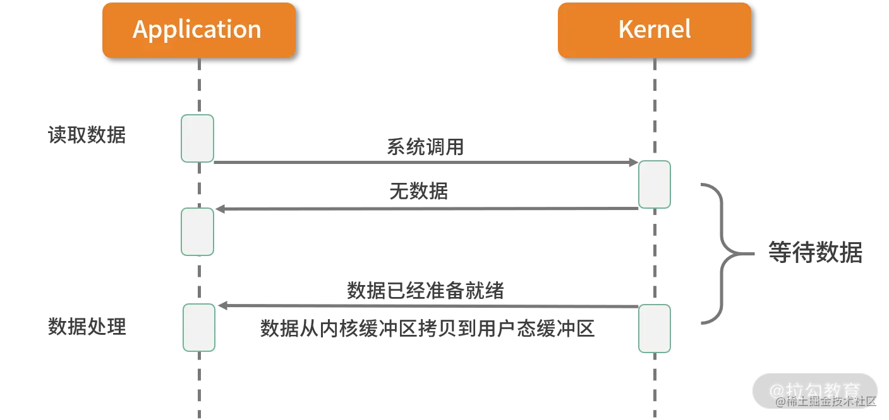

# IO 模型的基础知识

`I/O` 请求可以分为两个阶段，分别为调用阶段和执行阶段。

- 第一个阶段为 **I/O 调用阶段**，即用户进程向内核发起系统调用。
- 第二个阶段为 **I/O 执行阶段**。此时，内核等待 `I/O` 请求处理完成返回。该阶段分为两个过程：首先等待数据就绪，并写入内核缓冲区；随后将内核缓冲区数据拷贝至用户态缓冲区。

# Linux的5种主要IO模式

## 同步阻塞IO（BIO）

如上图所表现的那样，应用进程向内核发起 `I/O` 请求，发起调用的线程一直等待内核返回结果。一次完整的 `I/O` 请求称为 `BIO`（`Blocking IO`，阻塞 `I/O`），所以 `BIO` 在实现异步操作时，**只能使用多线程模型**，一个请求对应一个线程。但是，线程的资源是有限且宝贵的，创建过多的线程会增加线程切换的开销。

其实可以使用线程池解决线程过多的情况，但这就意味着，线程池的最大数量就是服务端可以支撑的最大并发数量。

可以联想到 `Java` 的 `Socket`：

- 服务端会有两个阻塞操作：一个是 `accept()`，也就是等待客户端连接，如果没有客户端连接，就会阻塞；第二个是 `getInputStream()`，如果客户端连接上了，但是没有发送数据，也是会阻塞的。
- 客户端获取数据也就是 `getInputStream()`，也是会阻塞的。

## 同步非阻塞 I/O（NIO）

如上图所示，应用进程向内核发起 `I/O` 请求后不再会同步等待结果，而是会立即返回，通过轮询的方式获取请求结果。

`NIO` 相比 `BIO` 虽然大幅提升了性能，但是轮询过程中大量的系统调用导致上下文切换开销很大（内核态与用户态的切换）。所以，**单独使用非阻塞 I/O 时效率并不高**，而且随着并发量的提升，非阻塞 `I/O` 会存在严重的性能浪费。

**为什么轮询会导致上下文开销很大呢？**

因为轮询操作是需要用户态切换到核心态的，这样是很耗费性能的。

## I/O多路复用

多路复用实现了**一个线程处理多个 I/O 句柄的操作**。多路指的是多个**数据通道**，复用指的是使用一个或多个固定线程来处理每一个 `Socket`。`select、poll、epoll` 都是 `I/O 多路复用`的具体实现，线程一次 `select` 调用可以获取内核态中多个数据通道的数据状态。

多路复用解决了同步阻塞 I/O 和同步非阻塞 I/O 的问题，是一种非常高效的 I/O 模型。

其实说简单点，就是**把轮询的操作放到内核中进行**了，这样就可以避免大量的用户态和内核态进行切换，`select、poll、epoll` 都是 `Linux` 内核提供的函数，目的就是在内核中遍历所有的文件描述符（在 `Linux` 中，一切皆文件，所以 `Socket` 被抽象成了文件，简称 fd）。

`Redis` 采用的就是 `IO` 多路复用模型。

## 信号驱动 I/O

信号驱动 I/O 并不常用，它是一种**半异步的 I/O 模型**。在使用信号驱动 I/O 时，当数据准备就绪后，内核通过发送一个 SIGIO 信号通知应用进程，应用进程就可以开始读取数据了。

## 异步I/O（AIO）

异步 I/O 最重要的一点是从内核缓冲区拷贝数据到用户态缓冲区的过程也是由系统异步完成，应用进程只需要在指定的数组中引用数据即可。

**异步 I/O 与信号驱动 I/O 这种半异步模式的主要区别**：信号驱动 I/O 由内核通知何时可以开始一个 I/O 操作，而异步 I/O 由内核通知 I/O 操作何时已经完成。

# JDK IO

在 JDK 1.4 投入使用之前，只有 BIO 一种模式。开发过程相对简单。新来一个连接就会创建一个新的线程处理。随着请求并发度的提升，BIO 很快遇到了性能瓶颈。

JDK 1.4 以后开始引入了 NIO 技术，支持 select 和 poll；

JDK 1.5 支持了 epoll；

JDK 1.7 发布了 NIO2，支持 AIO 模型。Java 在网络领域取得了长足的进步。

