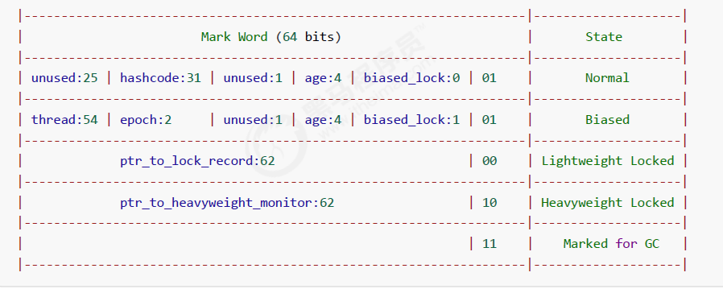

# synchronized 

## 怎么用？

### 同步块

锁对象：理论上可以是**任意的唯一对象**

synchronized 是可重入、不公平的重量级锁

原则上：

* 锁对象建议使用共享资源
* 在实例方法中使用 this 作为锁对象，锁住的 this 正好是共享资源
* 在静态方法中使用类名 .class 字节码作为锁对象，因为静态成员属于类，被所有实例对象共享，所以需要锁住类

同步代码块格式：

```java
synchronized(锁对象){
	// 访问共享资源的核心代码
}
```

实例：

```java
public class demo {
    static int counter = 0;
    //static修饰，则元素是属于类本身的，不属于对象  ，与类一起加载一次，只有一个
    static final Object room = new Object();
    public static void main(String[] args) throws InterruptedException {
        Thread t1 = new Thread(() -> {
            for (int i = 0; i < 5000; i++) {
                synchronized (room) {
                    counter++;
                }
            }
        }, "t1");
        Thread t2 = new Thread(() -> {
            for (int i = 0; i < 5000; i++) {
                synchronized (room) {
                    counter--;
                }
            }
        }, "t2");
        t1.start();
        t2.start();
        t1.join();
        t2.join();
        System.out.println(counter);
    }
}
```

### 同步方法

把出现线程安全问题的核心方法锁起来，每次只能一个线程进入访问

synchronized 修饰的方法的不具备继承性，所以子类是线程不安全的，如果子类的方法也被 synchronized 修饰，两个锁对象其实是一把锁，而且是**子类对象作为锁**

用法：直接给方法加上一个修饰符 synchronized

```java
//同步方法
修饰符 synchronized 返回值类型 方法名(方法参数) { 
	方法体；
}
//同步静态方法
修饰符 static synchronized 返回值类型 方法名(方法参数) { 
	方法体；
}
```

同步方法底层也是有锁对象的：

* 如果方法是实例方法：同步方法默认用 this 作为的锁对象

  ```java
  public synchronized void test() {} //等价于
  public void test() {
      synchronized(this) {}
  }
  ```

* 如果方法是静态方法：同步方法默认用类名 .class 作为的锁对象

  ```java
  class Test{
  	public synchronized static void test() {}
  }
  //等价于
  class Test{
      public void test() {
          synchronized(Test.class) {}
  	}
  }
  ```

## 线程八锁

线程八锁就是考察 synchronized 锁住的是哪个对象，直接百度搜索相关的实例

说明：主要关注锁住的对象是不是同一个

* 锁住类对象，所有类的实例的方法都是安全的，类的所有实例都相当于同一把锁
* 锁住 this 对象，只有在当前实例对象的线程内是安全的，如果有多个实例就不安全

线程不安全：因为锁住的不是同一个对象，线程 1 调用 a 方法锁住的类对象，线程 2 调用 b 方法锁住的 n2 对象，不是同一个对象

```java
class Number{
    public static synchronized void a(){
		Thread.sleep(1000);
        System.out.println("1");
    }
    public synchronized void b() {
        System.out.println("2");
    }
}
public static void main(String[] args) {
    Number n1 = new Number();
    Number n2 = new Number();
    new Thread(()->{ n1.a(); }).start();
    new Thread(()->{ n2.b(); }).start();
}
```

线程安全：因为 n1 调用 a() 方法，锁住的是类对象，n2 调用 b() 方法，锁住的也是类对象，所以线程安全

```java
class Number{
    public static synchronized void a(){
		Thread.sleep(1000);
        System.out.println("1");
    }
    public static synchronized void b() {
        System.out.println("2");
    }
}
public static void main(String[] args) {
    Number n1 = new Number();
    Number n2 = new Number();
    new Thread(()->{ n1.a(); }).start();
    new Thread(()->{ n2.b(); }).start();
}
```

## 锁原理

### Monitor

Monitor 被翻译为监视器或管程

每个 Java 对象都可以关联一个 Monitor 对象，Monitor 也是 class，其**实例存储在堆中**，如果使用 synchronized 给对象上锁（重量级）之后，该对象头的 Mark Word 中就被设置指向 Monitor 对象的指针，这就是重量级锁

* Mark Word 结构：最后两位是**锁标志位**

  

* 64 位虚拟机 Mark Word：

  

工作流程：

* 开始时 Monitor 中 Owner 为 null
* 当 Thread-2 执行 synchronized(obj) 就会将 Monitor 的所有者 Owner 置为 Thread-2，Monitor 中只能有一个 Owner，**obj 对象的 Mark Word 指向 Monitor**，把**对象原有的 MarkWord 存入线程栈中的锁记录**中（轻量级锁部分详解）
  
* 在 Thread-2 上锁的过程，Thread-3、Thread-4、Thread-5 也执行 synchronized(obj)，就会进入 EntryList BLOCKED（双向链表）
* Thread-2 执行完同步代码块的内容，根据 obj 对象头中 Monitor 地址寻找，设置 Owner 为空，把线程栈的锁记录中的对象头的值设置回 MarkWord
* 唤醒 EntryList 中等待的线程来竞争锁，竞争是**非公平的**，如果这时有新的线程想要获取锁，可能直接就抢占到了，阻塞队列的线程就会继续阻塞
* WaitSet 中的 Thread-0，是以前获得过锁，但条件不满足进入 WAITING 状态的线程（wait-notify 机制）


注意：

* synchronized 必须是进入同一个对象的 Monitor 才有上述的效果
* 不加 synchronized 的对象不会关联监视器，不遵从以上规则

### 字节码

代码：

```java
public static void main(String[] args) {
    Object lock = new Object();
    synchronized (lock) {
        System.out.println("ok");
    }
}
```

```java
0: 	new				#2		// new Object
3: 	dup
4: 	invokespecial 	#1 		// invokespecial <init>:()V，非虚方法
7: 	astore_1 				// lock引用 -> lock
8: 	aload_1					// lock （synchronized开始）
9: 	dup						// 一份用来初始化，一份用来引用
10: astore_2 				// lock引用 -> slot 2
11: monitorenter 			// 【将 lock对象 MarkWord 置为 Monitor 指针】
12: getstatic 		#3		// System.out
15: ldc 			#4		// "ok"
17: invokevirtual 	#5 		// invokevirtual println:(Ljava/lang/String;)V
20: aload_2 				// slot 2(lock引用)
21: monitorexit 			// 【将 lock对象 MarkWord 重置, 唤醒 EntryList】
22: goto 30
25: astore_3 				// any -> slot 3
26: aload_2 				// slot 2(lock引用)
27: monitorexit 			// 【将 lock对象 MarkWord 重置, 唤醒 EntryList】
28: aload_3
29: athrow
30: return
Exception table:
    from to target type
      12 22 25 		any
      25 28 25 		any
LineNumberTable: ...
LocalVariableTable:
    Start Length Slot Name Signature
    	0 	31 		0 args [Ljava/lang/String;
    	8 	23 		1 lock Ljava/lang/Object;
```

说明：

* 通过异常 **try-catch 机制**，确保一定会被解锁
* 方法级别的 synchronized 不会在字节码指令中有所体现

## 锁升级

### 升级过程

**synchronized 是可重入、不公平的重量级锁**，所以可以对其进行优化

```java
无锁 -> 偏向锁 -> 轻量级锁 -> 重量级锁	// 随着竞争的增加，只能锁升级，不能降级
```


### 偏向锁

偏向锁的思想是偏向于让第一个获取锁对象的线程，这个线程之后重新获取该锁不再需要同步操作：

* 当锁对象第一次被线程获得的时候进入偏向状态，标记为 101，同时**使用 CAS 操作将线程 ID 记录到 Mark Word**。如果 CAS 操作成功，这个线程以后进入这个锁相关的同步块，查看这个线程 ID 是自己的就表示没有竞争，就不需要再进行任何同步操作

* 当有另外一个线程去尝试获取这个锁对象时，偏向状态就宣告结束，此时撤销偏向（Revoke Bias）后恢复到未锁定或轻量级锁状态



一个对象创建时：

* 如果开启了偏向锁（默认开启），那么对象创建后，MarkWord 值为 0x05 即最后 3 位为 101，thread、epoch、age 都为 0
* 偏向锁是默认是延迟的，不会在程序启动时立即生效，如果想避免延迟，可以加 VM 参数 `-XX:BiasedLockingStartupDelay=0` 来禁用延迟。JDK 8 延迟 4s 开启偏向锁原因：在刚开始执行代码时，会有好多线程来抢锁，如果开偏向锁效率反而降低

* 当一个对象已经计算过 hashCode，就再也无法进入偏向状态了
* 添加 VM 参数 `-XX:-UseBiasedLocking` 禁用偏向锁

撤销偏向锁的状态：

* 调用对象的 hashCode：偏向锁的对象 MarkWord 中存储的是线程 id，调用 hashCode 导致偏向锁被撤销
* 当有其它线程使用偏向锁对象时，会将偏向锁升级为轻量级锁
* 调用 wait/notify，需要申请 Monitor，进入 WaitSet

**批量撤销**：如果对象被多个线程访问，但没有竞争，这时偏向了线程 T1 的对象仍有机会重新偏向 T2，重偏向会重置对象的 Thread ID

* 批量重偏向：当撤销偏向锁阈值超过 20 次后，JVM 会觉得是不是偏向错了，于是在给这些对象加锁时重新偏向至加锁线程

* 批量撤销：当撤销偏向锁阈值超过 40 次后，JVM 会觉得自己确实偏向错了，根本就不该偏向，于是整个类的所有对象都会变为不可偏向的，新建的对象也是不可偏向的

### 轻量级锁

一个对象有多个线程要加锁，但加锁的时间是错开的（没有竞争），可以使用轻量级锁来优化，轻量级锁对使用者是透明的（不可见）

可重入锁：线程可以进入任何一个它已经拥有的锁所同步着的代码块，可重入锁最大的作用是**避免死锁**

轻量级锁在没有竞争时（锁重入时），每次重入仍然需要执行 CAS 操作，Java 6 才引入的偏向锁来优化

锁重入实例：

```java
static final Object obj = new Object();
public static void method1() {
    synchronized( obj ) {
        // 同步块 A
        method2();
    }
}
public static void method2() {
    synchronized( obj ) {
    	// 同步块 B
    }
}
```

* 创建锁记录（Lock Record）对象，每个线程的**栈帧**都会包含一个锁记录的结构，存储锁定对象的 Mark Word

  

* 让锁记录中 Object reference 指向锁住的对象，并尝试用 CAS 替换 Object 的 Mark Word，将 Mark Word 的值存入锁记录

* 如果 CAS 替换成功，对象头中存储了锁记录地址和状态 00（轻量级锁） ，表示由该线程给对象加锁
  

* 如果 CAS 失败，有两种情况：

  * 如果是其它线程已经持有了该 Object 的轻量级锁，这时表明有竞争，进入锁膨胀过程
  * 如果是线程自己执行了 synchronized 锁重入，就添加一条 Lock Record 作为重入的计数

  

* 当退出 synchronized 代码块（解锁时）

  * 如果有取值为 null 的锁记录，表示有重入，这时重置锁记录，表示重入计数减 1
  * 如果锁记录的值不为 null，这时使用 CAS **将 Mark Word 的值恢复给对象头**
    * 成功，则解锁成功
    * 失败，说明轻量级锁进行了锁膨胀或已经升级为重量级锁，进入重量级锁解锁流程

### 锁膨胀

在尝试加轻量级锁的过程中，CAS 操作无法成功，可能是其它线程为此对象加上了轻量级锁（有竞争），这时需要进行锁膨胀，将轻量级锁变为**重量级锁**

* 当 Thread-1 进行轻量级加锁时，Thread-0 已经对该对象加了轻量级锁

  

* Thread-1 加轻量级锁失败，进入锁膨胀流程：为 Object 对象申请 Monitor 锁，**通过 Object 对象头获取到持锁线程**，将 Monitor 的 Owner 置为 Thread-0，将 Object 的对象头指向重量级锁地址，然后自己进入 Monitor 的 EntryList BLOCKED

  

* 当 Thread-0 退出同步块解锁时，使用 CAS 将 Mark Word 的值恢复给对象头失败，这时进入重量级解锁流程，即按照 Monitor 地址找到 Monitor 对象，设置 Owner 为 null，唤醒 EntryList 中 BLOCKED 线程

## 锁优化

### 自旋锁

重量级锁竞争时，尝试获取锁的线程不会立即阻塞，可以使用**自旋**（默认 10 次）来进行优化，采用循环的方式去尝试获取锁

注意：

* 自旋占用 CPU 时间，单核 CPU 自旋就是浪费时间，因为同一时刻只能运行一个线程，多核 CPU 自旋才能发挥优势
* 自旋失败的线程会进入阻塞状态

优点：不会进入阻塞状态，**减少线程上下文切换的消耗**

缺点：当自旋的线程越来越多时，会不断的消耗 CPU 资源

自旋锁情况：

* 自旋成功的情况：
      

* 自旋失败的情况：

  

自旋锁说明：

* 在 Java 6 之后自旋锁是自适应的，比如对象刚刚的一次自旋操作成功过，那么认为这次自旋成功的可能性会高，就多自旋几次；反之，就少自旋甚至不自旋，比较智能
* Java 7 之后不能控制是否开启自旋功能，由 JVM 控制

```java
//手写自旋锁
public class SpinLock {
    // 泛型装的是Thread，原子引用线程
    AtomicReference<Thread> atomicReference = new AtomicReference<>();

    public void lock() {
        Thread thread = Thread.currentThread();
        System.out.println(thread.getName() + " come in");

        //开始自旋，期望值为null，更新值是当前线程
        while (!atomicReference.compareAndSet(null, thread)) {
            Thread.sleep(1000);
            System.out.println(thread.getName() + " 正在自旋");
        }
        System.out.println(thread.getName() + " 自旋成功");
    }

    public void unlock() {
        Thread thread = Thread.currentThread();

        //线程使用完锁把引用变为null
		atomicReference.compareAndSet(thread, null);
        System.out.println(thread.getName() + " invoke unlock");
    }

    public static void main(String[] args) throws InterruptedException {
        SpinLock lock = new SpinLock();
        new Thread(() -> {
            //占有锁
            lock.lock();
            Thread.sleep(10000); 

            //释放锁
            lock.unlock();
        },"t1").start();

        // 让main线程暂停1秒，使得t1线程，先执行
        Thread.sleep(1000);

        new Thread(() -> {
            lock.lock();
            lock.unlock();
        },"t2").start();
    }
}
```

### 锁消除

锁消除是指对于被检测出不可能存在竞争的共享数据的锁进行消除，这是 JVM **即时编译器的优化**

锁消除主要是通过**逃逸分析**来支持，如果堆上的共享数据不可能逃逸出去被其它线程访问到，那么就可以把它们当成私有数据对待，也就可以将它们的锁进行消除（同步消除：JVM 逃逸分析）

### 锁粗化

对相同对象多次加锁，导致线程发生多次重入，频繁的加锁操作就会导致性能损耗，可以使用锁粗化方式优化

如果虚拟机探测到一串的操作都对同一个对象加锁，将会把加锁的范围扩展（粗化）到整个操作序列的外部

* 一些看起来没有加锁的代码，其实隐式的加了很多锁：

  ```java
  public static String concatString(String s1, String s2, String s3) {
      return s1 + s2 + s3;
  }
  ```

* String 是一个不可变的类，编译器会对 String 的拼接自动优化。在 JDK 1.5 之前，转化为 StringBuffer 对象的连续 append() 操作，每个 append() 方法中都有一个同步块

  ```java
  public static String concatString(String s1, String s2, String s3) {
      StringBuffer sb = new StringBuffer();
      sb.append(s1);
      sb.append(s2);
      sb.append(s3);
      return sb.toString();
  }
  ```

扩展到第一个 append() 操作之前直至最后一个 append() 操作之后，只需要加锁一次就可以

## 多把锁

多把不相干的锁：一间大屋子有两个功能睡觉、学习，互不相干。现在一人要学习，一人要睡觉，如果只用一间屋子（一个对象锁）的话，那么并发度很低

将锁的粒度细分：

* 好处，是可以增强并发度
* 坏处，如果一个线程需要同时获得多把锁，就容易发生死锁 

解决方法：准备多个对象锁

```java
public static void main(String[] args) {
    BigRoom bigRoom = new BigRoom();
    new Thread(() -> { bigRoom.study(); }).start();
    new Thread(() -> { bigRoom.sleep(); }).start();
}
class BigRoom {
    private final Object studyRoom = new Object();
    private final Object sleepRoom = new Object();

    public void sleep() throws InterruptedException {
        synchronized (sleepRoom) {
            System.out.println("sleeping 2 小时");
            Thread.sleep(2000);
        }
    }

    public void study() throws InterruptedException {
        synchronized (studyRoom) {
            System.out.println("study 1 小时");
            Thread.sleep(1000);
        }
    }
}
```

## 活跃性

### 死锁

#### 形成

死锁：多个线程同时被阻塞，它们中的一个或者全部都在等待某个资源被释放，由于线程被无限期地阻塞，因此程序不可能正常终止

Java 死锁产生的四个必要条件：

1. 互斥条件，即当资源被一个线程使用（占有）时，别的线程不能使用
2. 不可剥夺条件，资源请求者不能强制从资源占有者手中夺取资源，资源只能由资源占有者主动释放
3. 请求和保持条件，即当资源请求者在请求其他的资源的同时保持对原有资源的占有
4. 循环等待条件，即存在一个等待循环队列：p1 要 p2 的资源，p2 要 p1 的资源，形成了一个等待环路

四个条件都成立的时候，便形成死锁。死锁情况下打破上述任何一个条件，便可让死锁消失

```java
public class Dead {
    public static Object resources1 = new Object();
    public static Object resources2 = new Object();
    public static void main(String[] args) {
        new Thread(() -> {
            // 线程1：占用资源1 ，请求资源2
            synchronized(resources1){
                System.out.println("线程1已经占用了资源1，开始请求资源2");
                Thread.sleep(2000);//休息两秒，防止线程1直接运行完成。
                //2秒内线程2肯定可以锁住资源2
                synchronized (resources2){
                    System.out.println("线程1已经占用了资源2");
                }
        }).start();
        new Thread(() -> {
            // 线程2：占用资源2 ，请求资源1
            synchronized(resources2){
                System.out.println("线程2已经占用了资源2，开始请求资源1");
                Thread.sleep(2000);
                synchronized (resources1){
                    System.out.println("线程2已经占用了资源1");
                }
            }}
        }).start();
    }
}
```

#### 定位

定位死锁的方法：

* 使用 jps 定位进程 id，再用 `jstack id` 定位死锁，找到死锁的线程去查看源码，解决优化

  ```sh
  "Thread-1" #12 prio=5 os_prio=0 tid=0x000000001eb69000 nid=0xd40 waiting formonitor entry [0x000000001f54f000]
  	java.lang.Thread.State: BLOCKED (on object monitor)
  #省略    
  "Thread-1" #12 prio=5 os_prio=0 tid=0x000000001eb69000 nid=0xd40 waiting for monitor entry [0x000000001f54f000]
  	java.lang.Thread.State: BLOCKED (on object monitor)
  #省略
  
  Found one Java-level deadlock:
  ===================================================
  "Thread-1":
      waiting to lock monitor 0x000000000361d378 (object 0x000000076b5bf1c0, a java.lang.Object),
      which is held by "Thread-0"
  "Thread-0":
      waiting to lock monitor 0x000000000361e768 (object 0x000000076b5bf1d0, a java.lang.Object),
      which is held by "Thread-1"
      
  Java stack information for the threads listed above:
  ===================================================
  "Thread-1":
      at thread.TestDeadLock.lambda$main$1(TestDeadLock.java:28)
      - waiting to lock <0x000000076b5bf1c0> (a java.lang.Object)
      - locked <0x000000076b5bf1d0> (a java.lang.Object)
      at thread.TestDeadLock$$Lambda$2/883049899.run(Unknown Source)
      at java.lang.Thread.run(Thread.java:745)
  "Thread-0":
      at thread.TestDeadLock.lambda$main$0(TestDeadLock.java:15)
      - waiting to lock <0x000000076b5bf1d0> (a java.lang.Object)
      - locked <0x000000076b5bf1c0> (a java.lang.Object)
      at thread.TestDeadLock$$Lambda$1/495053715
  ```

* Linux 下可以通过 top 先定位到 CPU 占用高的 Java 进程，再利用 `top -Hp 进程id` 来定位是哪个线程，最后再用 jstack <pid>的输出来看各个线程栈

* 避免死锁：避免死锁要注意加锁顺序

* 可以使用 jconsole 工具，在 `jdk\bin` 目录下

### 活锁

活锁：指的是任务或者执行者没有被阻塞，由于某些条件没有满足，导致一直重复尝试—失败—尝试—失败的过程

两个线程互相改变对方的结束条件，最后谁也无法结束：

```java
class TestLiveLock {
    static volatile int count = 10;
    static final Object lock = new Object();
    public static void main(String[] args) {
        new Thread(() -> {
            // 期望减到 0 退出循环
            while (count > 0) {
                Thread.sleep(200);
                count--;
                System.out.println("线程一count:" + count);
            }
        }, "t1").start();
        new Thread(() -> {
            // 期望超过 20 退出循环
            while (count < 20) {
                Thread.sleep(200);
                count++;
                System.out.println("线程二count:"+ count);
            }
        }, "t2").start();
    }
}
```

### 饥饿

饥饿：一个线程由于优先级太低，始终得不到 CPU 调度执行，也不能够结束


# 面试问题

## 锁升级的过程

## 为什么需要偏向锁？

考虑如果大部分时间只有一个线程去请求资源，这时候还搞重量级锁那一套（monitor对象，开启阻塞队列），有点大材小用（浪费资源）。

所以引入了偏向锁。

## 偏向锁，代码执行完后会释放对象头MarkWord中的Thread_Id么？

不会的。

下次如果该线程再获取锁的时候，可以直接执行。

## 轻量级锁-重量级锁的过程？以及自适应自旋的理解

## synchronized和lock的区别

- lock是一个接口，synchronized是一个关键字，synchronized是内置的语言实现
- synchronized在发生异常时候会自动释放锁，不会出现死锁；lock发生异常时候，不会主动释放锁，必须手动unlock来释放锁。
- lock更加灵活，比如可以中断等待，trylock知道有没有获取锁，还可以实现读写分离（readwritelock）

## 一个类里如果有多个synchronized方法，同一个对象可以同时访问两个不同的synchronized方法么？为什么？

不可以