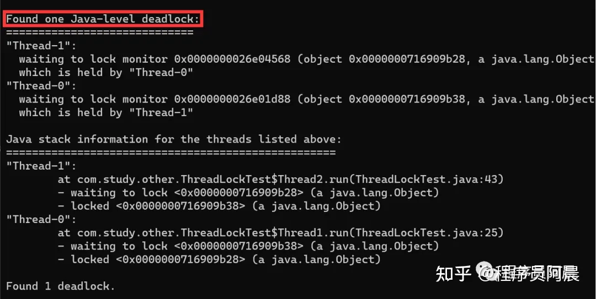
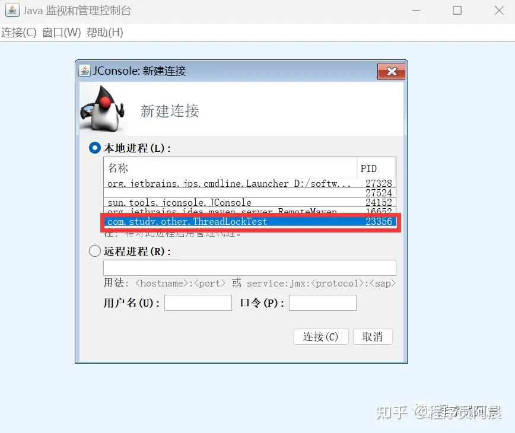
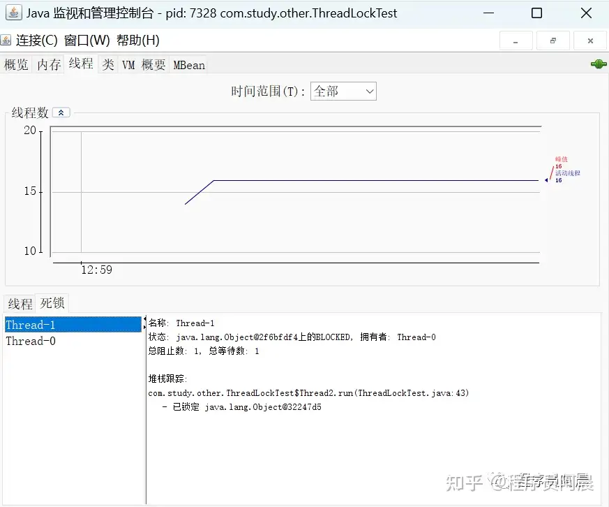
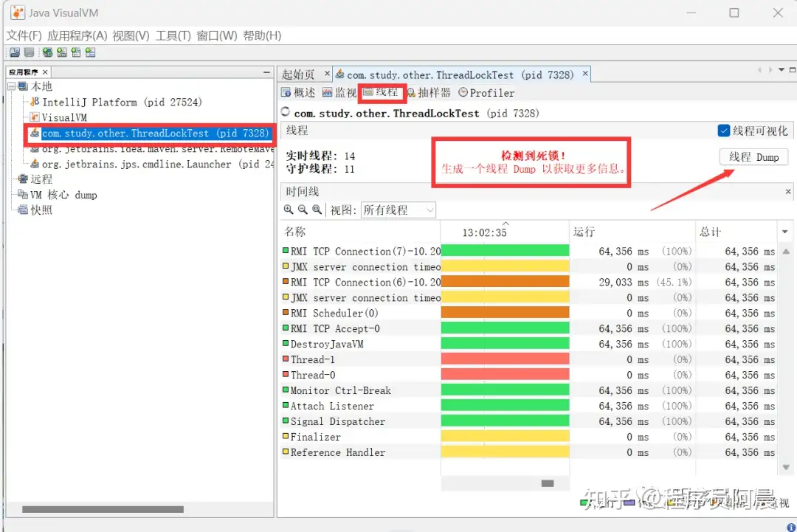
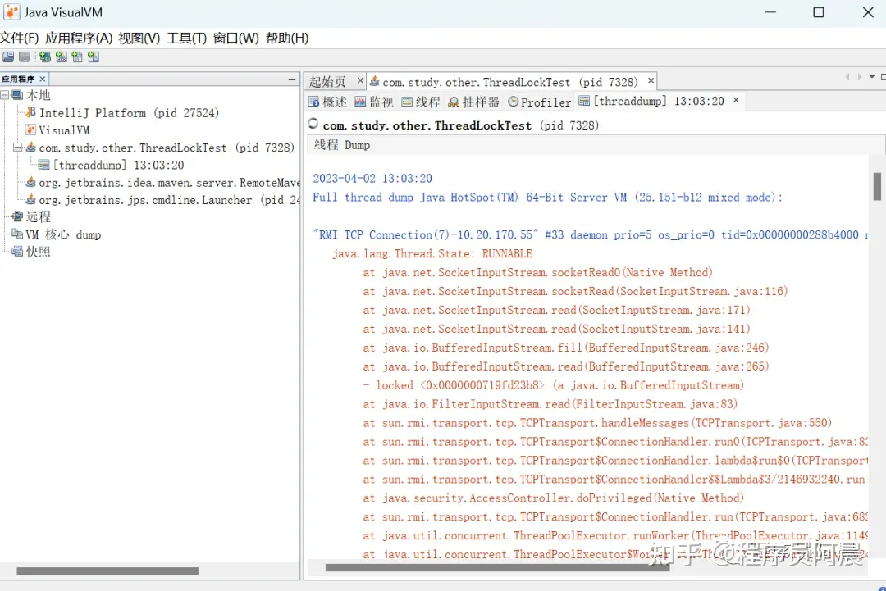

# 查看线程死锁的三种方式

## jps、jstack

`jps`，查看正在运行中的java虚拟机进程，获取pid。

命令行输入`jstack` pid 即可查询得到线程死锁情况。

## jconsole

找到java的安装路径，进入jdk目录下的bin目录，点击jconsole.exe

检测死锁

## jvisualvm

找到java的安装路径，进入jdk目录下的bin目录，点击jvisualvm.exe

点击Dump，查看更多信息

