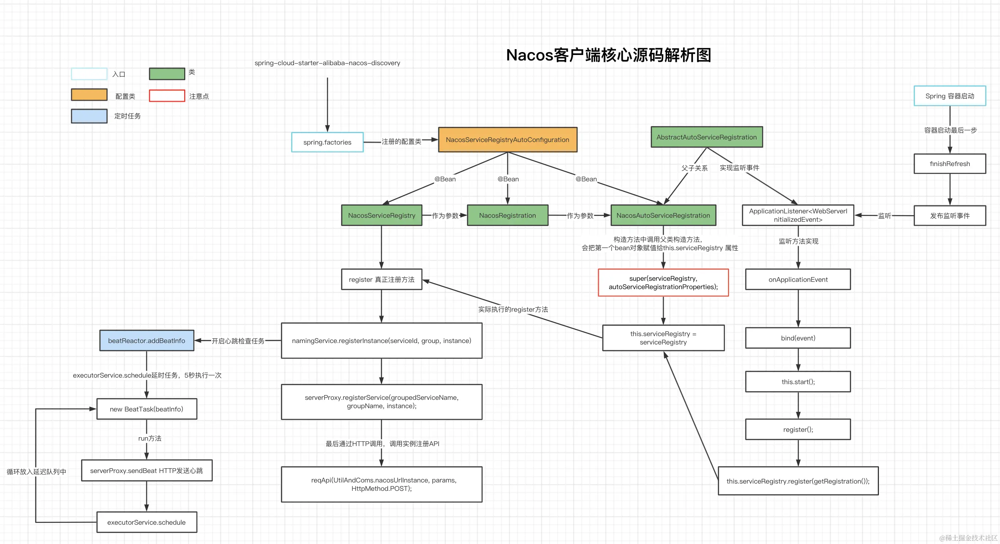
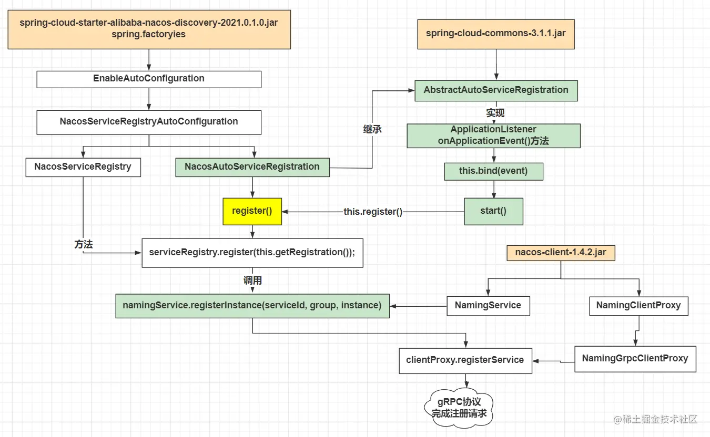

# Nacos

## 服务注册流程

注册步骤小结：

1. 读取Spring Boot装载配置文件 **spring.factories**，找到启动类 **NacosAutoServiceRegistration**；
2. **NacosAutoServiceRegistration** 继承 **AbstractAutoServiceRegistration**，它实现 **ApplicationListener** 接口；
3. 实现ApplicationListener接口的 **onApplicationEvent** 方法，该方法调用 **bind()** ，然后调用 **start()** 方法；
4. start()方法中调用register()，该方法调用 **NacosServiceRegistry** 的register方法；
5. NacosServiceRegistry的register方法内部调用 **NacosNamingService** 的 **registerInstance** 方法；
6. 根据实例的瞬时状态选择不同的proxy执行注册，默认是 **gRPC** 协议的 **NamingGrpcClientProxy** 执行注册；
7. 完成实例注册（POST请求 `/nacos/v1/ns/instance`）。

# 面试题

## Nacos是AP还是CP？

Nacos默认是AP，支持AP和CP模式的切换。

如果注册Nacos的client节点注册时ephemeral=true，那么Nacos集群对这个client节点的效果就是AP，采用distro协议实现；而注册Nacos的client节点注册时ephemeral=false，那么Nacos集群对这个节点的效果就是CP的，采用raft协议实现。根据client注册时的属性，AP，CP同时混合存在，只是对不同的client节点效果不同。Nacos可以很好的解决不同场景的业务需求。

## Nacos的服务注册表结构是怎样的？

Nacos采用了数据的分级存储模型，最外层是Namespace，用来隔离环境。然后是Group，用来对服务分组。接下来就是服务（Service）了，一个服务包含多个实例，但是可能处于不同机房，因此Service下有多个集群（Cluster），Cluster下是不同的实例（Instance）。

对应到Java代码中，Nacos采用了一个多层的Map来表示。结构为Map<String, Map<String, Service>>，其中最外层Map的key就是namespaceId，值是一个Map。内层Map的key是group拼接serviceName，值是Service对象。Service对象内部又是一个Map，key是集群名称，值是Cluster对象。而Cluster对象内部维护了Instance的集合。

## Nacos如何支撑阿里内部数十万服务注册压力？

Nacos内部接收到注册的请求时，不会立即写数据，而是将服务注册的任务放入一个阻塞队列就立即响应给客户端。然后利用线程池读取阻塞队列中的任务，异步来完成实例更新，从而提高并发写能力。

## Nacos如何避免并发读写冲突问题？

Nacos在更新实例列表时，会采用CopyOnWrite技术，首先将旧的实例列表拷贝一份，然后更新拷贝的实例列表，再用更新后的实例列表来覆盖旧的实例列表。

这样在更新的过程中，就不会对读实例列表的请求产生影响，也不会出现脏读问题了。

## Nacos与Eureka的区别有哪些？

Nacos与Eureka有相同点，也有不同之处，可以从以下几点来描述：

- 接口方式：Nacos与Eureka都对外暴露了Rest风格的API接口，用来实现服务注册、发现等功能
- 实例类型：Nacos的实例有永久和临时实例之分；而Eureka只支持临时实例
- 健康检测：Nacos对临时实例采用心跳模式检测，对永久实例采用主动请求来检测；Eureka只支持心跳模式
- 服务发现：Nacos支持定时拉取和订阅推送两种模式；Eureka只支持定时拉取模式
