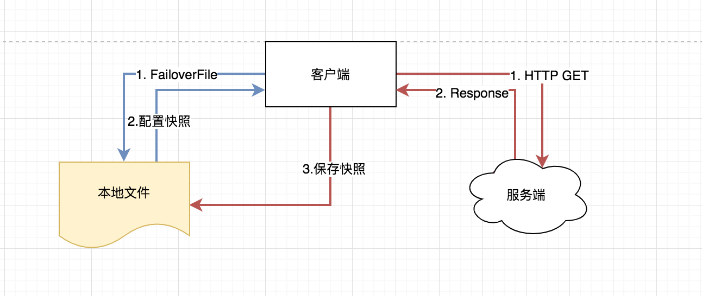
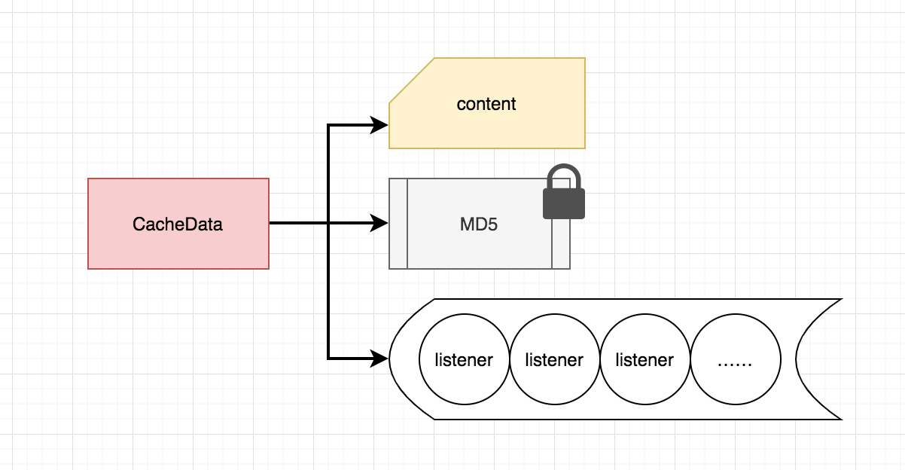
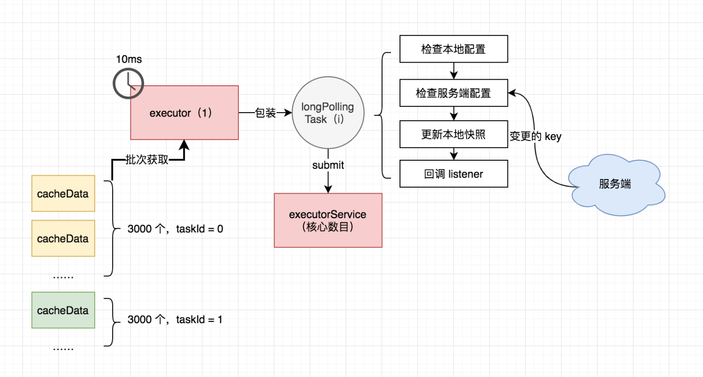
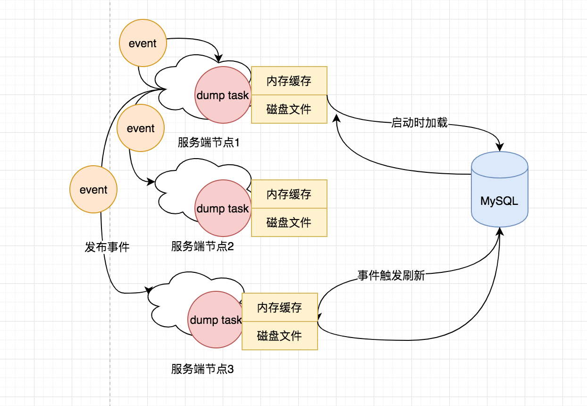
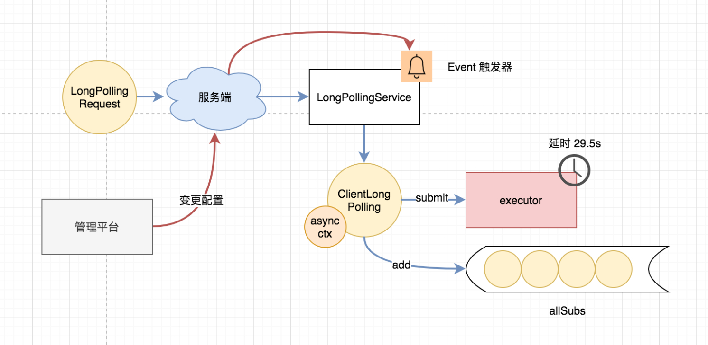
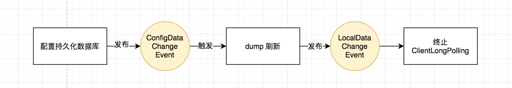

## Nacos 客户端解析

### 获取配置

获取配置的主要方法是 `NacosConfigService` 类的 `getConfigInner` 方法，通常情况下该方法直接从本地文件中取得配置的值，如果本地文件不存在或者内容为空，则再通过 `HTTP GET` 方法从远端拉取配置，并保存到本地快照中。




当通过 `HTTP` 获取远端配置时，`Nacos` 提供了两种熔断策略，一是超时时间，二是最大重试次数，默认重试三次。

### 注册监听器

配置中心客户端对某个配置项注册监听器是很常见的需求，达到在配置项变更的时候执行回调的功能。

```java
iconfig.addListener(dataId, group, ml);
iconfig.getConfigAndSignListener(dataId, group, 1000, ml);
```

`Nacos` 可以通过以上方式注册监听器，它们内部的实现均是调用 `ClientWorker` 类的 `addCacheDataIfAbsent`。其中 `CacheData` 是一个维护配置项和其下注册的所有监听器的实例，私以为这个名字取得并不好，不容易理解。

所有的 `CacheData` 都保存在 `ClientWorker` 类中的原子 `cacheMap` 中，其内部的核心成员有：




其中，`content` 是配置内容，`MD5` 值是用来检测配置是否发生变更的关键，内部还维护着一个若干监听器组成的数组，一旦发生变更则依次回调这些监听器。

### 配置长轮询

`ClientWorker` 通过其下的两个线程池完成配置长轮询的工作，一个是单线程的 `executor`，每隔 `10ms` 按照每 `3000` 个配置项为一批次捞取待轮询的 `cacheData` 实例，将其包装成为一个 `LongPollingTask` 提交进入第二个线程池 `executorService` 处理。




该长轮询任务内部主要分为四步：

1. 检查本地配置，忽略本地快照不存在的配置项，检查是否存在需要回调监听器的配置项
2. 如果本地没有配置项的，从服务端拿，返回配置内容发生变更的键值列表
3. 每个键值再到服务端获取最新配置，更新本地快照，补全之前缺失的配置
4. 检查 `MD5` 标签是否一致，不一致需要回调监听器

如果该轮询任务抛出异常，等待一段时间再开始下一次调用，减轻服务端压力。另外，`Nacos` 在 `HTTP` 工具类中也有限流器的代码，通过多种手段降低轮询或者大流量情况下的风险。如果在服务端没有发现变更的键值，那么服务端会夯住这个 `HTTP` 请求一段时间（客户端侧默认传递的超时是 `30s`），以此进一步减轻客户端的轮询频率和服务端的压力。

## Nacos 服务端解析

### 配置 Dump

服务端启动时就会依赖 `DumpService` 的 `init` 方法，从数据库中 `load` 配置存储在本地磁盘上，并将一些重要的元信息例如 `MD5` 值缓存在内存中。服务端会根据心跳文件中保存的最后一次心跳时间，来判断到底是从数据库 `dump` 全量配置数据还是部分增量配置数据（如果机器上次心跳间隔是 `6h` 以内的话）。

全量 `dump` 当然先清空磁盘缓存，然后根据主键 `ID` 每次捞取一千条配置刷进磁盘和内存。增量 `dump` 就是捞取最近六小时的新增配置（包括更新的和删除的），先按照这批数据刷新一遍内存和文件，再根据内存里所有的数据全量去比对一遍数据库，如果有改变的再同步一次，相比于全量 `dump` 的话会减少一定的数据库 `IO` 和磁盘 `IO` 次数。

### 配置注册

`Nacos` 服务端是一个 `SpringBoot` 实现的服务，注册配置主要代码位于 `ConfigController` 和 `ConfigServletInner` 中。服务端一般是多节点部署的集群，因此请求一开始只会打到一台机器，这台机器将配置插入 `MySQL` 中进行持久化，这部分代码很简单不再赘述。

因为服务端并不是针对每次配置查询都去访问 `MySQL` 的，而是会依赖 `dump` 功能在本地文件中将配置缓存起来。因此当单台机器保存完毕配置之后，需要通知其他机器刷新内存和本地磁盘中的文件内容，因此它会发布一个名为 `ConfigDataChangeEvent` 的事件，这个事件会通过 `HTTP` 调用通知所有集群节点（包括自身），触发本地文件和内存的刷新。




### 处理长轮询

上文提到，客户端会有一个长轮询任务，拉取服务端的配置变更，那么服务端是如何处理这个长轮询任务的呢？源码逻辑位于 `LongPollingService` 类，其中有一个 `Runnable` 任务名为 `ClientLongPolling`，服务端会将受到的轮询请求包装成一个 `ClientLongPolling` 任务，该任务持有一个 `AsyncContext` 响应对象（`Servlet 3.0` 的新机制），通过定时线程池延后 `29.5s` 执行。

> 为什么比客户端 `30s` 的超时时间提前 `500ms` 返回是为了最大程度上保证客户端不会因为网络延时造成超时




这里需要注意的是，在 `ClientLongPolling` 任务被提交进入线程池待执行的同时，服务端也通过一个队列 `allSubs` 保存了所有正在被夯住的轮询请求，这是因为在配置项被夯住的期间内，如果用户通过管理平台操作了配置项变更、或者服务端该节点收到了来自其他节点的 `dump` 刷新通知，那么都应立即取消夯住的任务，及时通知客户端数据发生了变更。

为了达到这个目的，`LongPollingService` 类继承自 `Event` 接口，实际上本身是个事件触发器，需要实现 `onEvent` 方法，其事件类型是 `LocalDataChangeEvent`。

当服务端在请求被夯住的期间接收到某项配置变更时，就会发布一个 `LocalDataChangeEvent` 类型的事件通知（注意同上文中的 `ConfigDataChangeEvent` 区别），之后会将这个变更包装成一个 `DataChangeTask` 异步执行，内容就是从 `allSubs` 中找出夯住的 `ClientLongPolling` 请求，写入变更强制其立即返回。

因此完整的流程如下，如果非接收请求的节点，那么忽略第一步持久化配置后开始：



