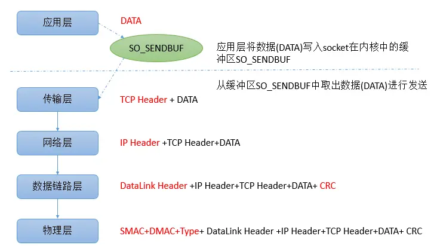
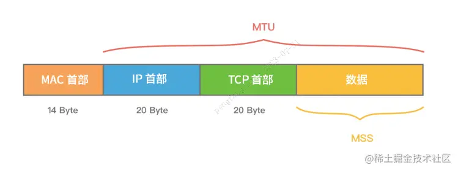

# Netty粘包与拆包

## 写在前面

我们知道TCP具有面向连接、可靠、**基于字节流**三大特点。字节流可以理解为一个双向的通道里流淌的数据，这个数据其实就是我们常说的二进制数据，简单来说就是一大堆 01 串。纯裸TCP收发的这些 01 串之间是没有任何边界的，你根本不知道到哪个地方才算一条完整消息。tcp是流式传输没有数据包的概念，所以每次会先把**缓冲池**填满再发送，这就会偶尔出现一种一段信息分了两次传输的情况。

## 什么是粘包与拆包？

TCP会根据**缓冲区**的实际情况进行包的划分，实际场景可能是：

- 当 TCP 发送缓冲区剩余空间不足时，一个完整的包可能会被拆分为多个包进行发送，即可能发生拆包情况。
- 当 TCP 发送缓冲区剩余空间足够时，多个小的包也有可能被封装成一个大的包进行发送，即可能发生粘包情况。

## 产生粘包拆包的原因

粘包、拆包问题的产生原因主要有以下3种：

- socket缓冲区与滑动窗口
- MSS/MTU限制
- Nagle算法

### socket缓冲区与滑动窗口

先明确一个概念：每个TCP socket在内核中都有一个发送缓冲区(`SO_SNDBUF` )和一个接收缓冲区(`SO_RCVBUF`)，TCP的全双工的工作模式以及TCP的滑动窗口便是依赖于这两个独立的buffer以及此buffer的填充状态。`SO_SNDBUF`和`SO_RCVBUF` 在windows操作系统中默认情况下都是8K。

#### SO_SNDBUF

进程发送的数据的时候(假设调用了一个send方法)，最简单情况（也是一般情况），将数据拷贝进入socket的内核发送缓冲区之中，然后send便会在上层返回。换句话说，send返回之时，数据不一定会发送到对端去（和write写文件有点类似），send仅仅是把应用层buffer的数据拷贝进socket的内核发送buffer中。

#### SO_RCVBUF

把接受到的数据缓存入内核，应用进程一直没有调用read进行读取的话，此数据会一直缓存在相应socket的接收缓冲区内。不管进程是否读取socket，对端发来的数据都会经由内核接收并且缓存到socket的内核接收缓冲区之中。read所做的工作，就是把内核缓冲区中的数据拷贝到应用层用户的buffer里面，仅此而已。

### 滑动窗口

TCP链接在三次握手的时候，会将自己的**窗口大小**(window size)发送给对方，其实就是`SO_RCVBUF`指定的值。之后在发送数据的时，发送方必须要先确认接收方的窗口没有被填充满，如果没有填满，则可以发送。

每次发送数据后，发送方将自己维护的对方的window size减小，表示对方的`SO_RCVBUF`可用空间变小。

当接收方处理开始处理`SO_RCVBUF` 中的数据时，会将数据从socket 在内核中的接受缓冲区读出，此时接收方的`SO_RCVBUF`可用空间变大，即window size变大，接受方会以ack消息的方式将自己最新的window size返回给发送方，此时发送方将自己的维护的接受的方的window size设置为ack消息返回的window size。

此外，发送方可以连续的给接受方发送消息，只要保证对方的`SO_RCVBUF`空间可以缓存数据即可。当接收方的`SO_RCVBUF`被填充满时，此时window size=0，发送方不能再继续发送数据，要等待接收方ack消息，以获得最新可用的window size。

现在来看一下`SO_RCVBUF`和滑动窗口是如何造成粘包、拆包的。

**粘包：**假设发送方的每256 bytes表示一个完整的报文，接收方由于数据处理不及时，这256个字节的数据都会被缓存到`SO_RCVBUF`中。如果接收方的`SO_RCVBUF`中缓存了多个报文，那么对于接收方而言，这就是粘包。

**拆包：**考虑另外一种情况，假设接收方的window size只剩了128，意味着发送方最多还可以发送128字节，而由于发送方的数据大小是256字节，因此只能发送前128字节，等到接收方ack后，才能发送剩余字节。这就造成了拆包。

### MSS和MTU分片

`MSS`是`Maximum Segement Size`的缩写，表示TCP报文中data部分的最大长度，是TCP协议在OSI五层网络模型中传输层(transport layer)对一次可以发送的最大数据的限制。

`MTU`最大传输单元是`Maxitum Transmission Unit`的简写，是OSI五层网络模型中链路层对一次可以发送的最大数据的限制。

当需要传输的数据大于MSS或者MTU时，数据会被拆分成多个包进行传输。由于MSS是根据MTU计算出来的，因此当发送的数据满足MSS时，必然满足MTU。归根结底：**限制一次可发送数据大小的是MTU，MSS只是TCP协议在MTU基础限制的传输层一次可传输的数据的大小**。

为了更好的理解，我们先介绍一下在5层网络模型中应用通过TCP发送数据的流程：



- 对于应用层来说，只关心发送的数据DATA，将数据写入socket在内核中的缓冲区`SO_SNDBUF`即返回，操作系统会将`SO_SNDBUF`中的数据取出来进行发送。
- 传输层会在DATA前面加上`TCP Header`,构成一个完整的TCP报文。
- 当数据到达网络层时，网络层会在TCP报文的基础上再添加一个`IP Header`，也就是将自己的网络地址加入到报文中。
- 到数据链路层时，还会加上`Datalink Header`和`CRC`。
- 当到达物理层时，会将`SMAC`(Source Machine，数据发送方的MAC地址)，`DMAC`(Destination Machine，数据接受方的MAC地址 )和`Type`域加入。

可以发现数据在发送前，每一层都会在上一层的基础上增加一些内容。

**MTU（Maxitum Transmission Unit）** **是链路层一次最大传输数据的大小。MTU 一般来说大小为 1500 byte。**

**MSS（Maximum Segement Size）是指 TCP 最大报文段长度，它是传输层一次发送最大数据的大小。MSS一般大小是1460**

如下图所示，MTU 和 MSS 一般的计算关系为：**MSS = MTU - IP 首部 - TCP首部**。

如果 MSS + TCP 首部 + IP 首部 > MTU，那么数据包将会被拆分为多个发送。这就是拆包现象。



linux服务器上输入ifconfig命令，可以查看不同网卡的MTU大小，如下：

```bash
# ifconfig
eth0      Link encap:Ethernet  HWaddr 00:16:3E:02:0E:EA 
          inet addr:10.144.211.78  Bcast:10.144.223.255  Mask:255.255.240.0
          UP BROADCAST RUNNING MULTICAST  MTU:1500  Metric:1
          RX packets:266023788 errors:0 dropped:0 overruns:0 frame:0
          TX packets:1768555 errors:0 dropped:0 overruns:0 carrier:0
          collisions:0 txqueuelen:1000
          RX bytes:12103832054 (11.2 GiB)  TX bytes:138231258 (131.8 MiB)
          Interrupt:164
 
 
lo        Link encap:Local Loopback 
          inet addr:127.0.0.1  Mask:255.0.0.0
          UP LOOPBACK RUNNING  MTU:65535  Metric:1
          RX packets:499956845 errors:0 dropped:0 overruns:0 frame:0
          TX packets:499956845 errors:0 dropped:0 overruns:0 carrier:0
          collisions:0 txqueuelen:0
          RX bytes:86145804231 (80.2 GiB)  TX bytes:86145804231 (80.2 GiB)
```

可以看到，默认情况下，与外部通信的网卡eth0的MTU大小是1500个字节。而本地回环地址的MTU大小为65535，这是因为本地测试时数据不需要走网卡，所以不受到1500的限制。

MTU的大小可以通过类似以下命令修改：

```shell
ip link set eth0 mtu 65535
```

### Nagle算法

TCP/IP协议中，无论发送多少数据，总是要在数据前面加上协议头，同时，对方接收到数据，也需要发送ACK表示确认。

即使从键盘输入的一个字符，占用一个字节，可能在传输上造成41字节的包，其中包括1字节的有用信息和40字节的首部数据。这种情况转变成了4000%的消耗，这样的情况对于重负载的网络来是无法接受的。

为了尽可能的利用网络带宽，TCP总是希望尽可能的发送足够大的数据。（一个连接会设置MSS参数，因此，TCP/IP希望每次都能够以MSS尺寸的数据块来发送数据）。Nagle算法就是为了尽可能发送大块数据，避免网络中充斥着许多小数据块。

Nagle算法的基本定义是任意时刻，最多只能有一个未被确认的小段。 所谓“小段”，指的是小于MSS尺寸的数据块，所谓“未被确认”，是指一个数据块发送出去后，没有收到对方发送的ACK确认该数据已收到。

**Nagle算法的规则：**

1. 如果`SO_SNDBUF`中的数据长度达到MSS，则允许发送；
2. 如果该`SO_SNDBUF`中含有FIN，表示请求关闭连接，则先将`SO_SNDBUF`中的剩余数据发送，再关闭；
3. 设置了`TCP_NODELAY=true`选项，则允许发送。`TCP_NODELAY`是取消TCP的确认延迟机制，相当于禁用了Negale 算法。正常情况下，当Server端收到数据之后，它并不会马上向client端发送ACK，而是会将ACK的发送延迟一段时间（假一般是40ms），它希望在t时间内server端会向client端发送应答数据，这样ACK就能够和应答数据一起发送，就像是应答数据捎带着ACK过去。当然，TCP确认延迟40ms并不是一直不变的，TCP连接的延迟确认时间一般初始化为最小值40ms，随后根据连接的重传超时时间（RTO）、上次收到数据包与本次接收数据包的时间间隔等参数进行不断调整。另外可以通过设置`TCP_QUICKACK`选项来取消确认延迟。
4. 未设置`TCP_CORK`选项时，若所有发出去的小数据包（包长度小于MSS）均被确认，则允许发送;
5. 上述条件都未满足，但发生了超时（一般为200ms），则立即发送。

## 现象演示

在 TCP 传输中，客户端发送消息时，实际上是将数据写入 TCP 的缓存，此时数据的大小和缓存的大小就会造成粘包和半包

* 当数据超过 TCP 缓存容量时，就会被拆分成多个包，通过 Socket 多次发送到服务端，服务端每次从缓存中取数据，产生半包问题

* 当数据小于 TCP 缓存容量时，缓存中可以存放多个包，客户端和服务端一次通信就可能传递多个包，这时候服务端就可能一次读取多个包，产生粘包的问题

代码演示：

* 客户端代码：

  ```java
  public class HelloWorldClient {
      public static void main(String[] args) {
          send();
      }
  
      private static void send() {
          NioEventLoopGroup worker = new NioEventLoopGroup();
          try {
              Bootstrap bootstrap = new Bootstrap();
              bootstrap.channel(NioSocketChannel.class);
              bootstrap.group(worker);
              bootstrap.handler(new ChannelInitializer<SocketChannel>() {
                  @Override
                  protected void initChannel(SocketChannel ch) throws Exception {
                      ch.pipeline().addLast(new ChannelInboundHandlerAdapter() {
                          // 【在连接 channel 建立成功后，会触发 active 方法】
                          @Override
                          public void channelActive(ChannelHandlerContext ctx) throws Exception {
                              // 发送内容随机的数据包
                              Random r = new Random();
                              char c = '0';
                              ByteBuf buf = ctx.alloc().buffer();
                              for (int i = 0; i < 10; i++) {
                                  byte[] bytes = new byte[10];
                                  for (int j = 0; j < r.nextInt(9) + 1; j++) {
                                      bytes[j] = (byte) c;
                                  }
                                  c++;
                                  buf.writeBytes(bytes);
                              }
                              ctx.writeAndFlush(buf);
                          }
                      });
                  }
              });
              ChannelFuture channelFuture = bootstrap.connect("127.0.0.1", 8080).sync();
              channelFuture.channel().closeFuture().sync();
  
          } catch (InterruptedException e) {
              log.error("client error", e);
          } finally {
              worker.shutdownGracefully();
          }
      }
  }
  ```

* 服务器代码：

  ```java
  public class HelloWorldServer {
      public static void main(String[] args) {
          NioEventLoopGroup boss = new NioEventLoopGroup(1);
          NioEventLoopGroup worker = new NioEventLoopGroup();
          try {
              ServerBootstrap serverBootstrap = new ServerBootstrap();
              serverBootstrap.channel(NioServerSocketChannel.class);
              // 调整系统的接受缓冲区【滑动窗口】
              //serverBootstrap.option(ChannelOption.SO_RCVBUF, 10);
              // 调整 netty 的接受缓冲区（ByteBuf）
              //serverBootstrap.childOption(ChannelOption.RCVBUF_ALLOCATOR, 
              //                            new AdaptiveRecvByteBufAllocator(16, 16, 16));
              serverBootstrap.group(boss, worker);
              serverBootstrap.childHandler(new ChannelInitializer<SocketChannel>() {
                  @Override
                  protected void initChannel(SocketChannel ch) throws Exception {
                      // 【这里可以添加解码器】
                      // LoggingHandler 用来打印消息
                      ch.pipeline().addLast(new LoggingHandler(LogLevel.DEBUG));
                  }
              });
              ChannelFuture channelFuture = serverBootstrap.bind(8080);
              channelFuture.sync();
              channelFuture.channel().closeFuture().sync();
          } catch (InterruptedException e) {
              log.error("server error", e);
          } finally {
              boss.shutdownGracefully();
              worker.shutdownGracefully();
              log.debug("stop");
          }
      }
  }
  ```

* 粘包效果展示：

  ```java
  09:57:27.140 [nioEventLoopGroup-3-1] DEBUG io.netty.handler.logging.LoggingHandler - [id: 0xddbaaef6, L:/127.0.0.1:8080 - R:/127.0.0.1:8701] READ: 100B	// 读了 100 字节，发生粘包
           +-------------------------------------------------+
           |  0  1  2  3  4  5  6  7  8  9  a  b  c  d  e  f |
  +--------+-------------------------------------------------+----------------+
  |00000000| 30 30 30 30 30 00 00 00 00 00 31 00 00 00 00 00 |00000.....1.....|
  |00000010| 00 00 00 00 32 32 32 32 00 00 00 00 00 00 33 00 |....2222......3.|
  |00000020| 00 00 00 00 00 00 00 00 34 34 00 00 00 00 00 00 |........44......|
  |00000030| 00 00 35 35 35 35 00 00 00 00 00 00 36 36 36 00 |..5555......666.|
  |00000040| 00 00 00 00 00 00 37 37 37 37 00 00 00 00 00 00 |......7777......|
  |00000050| 38 38 38 38 38 00 00 00 00 00 39 39 00 00 00 00 |88888.....99....|
  |00000060| 00 00 00 00                                     |....            |
  +--------+-------------------------------------------------+----------------+
  ```

解决方法：通过调整系统的接受缓冲区的滑动窗口和 Netty 的接受缓冲区保证每条包只含有一条数据，滑动窗口的大小仅决定了 Netty 读取的**最小单位**，实际每次读取的一般是它的整数倍

## 解决方案

### 短连接

发一个包建立一次连接，这样连接建立到连接断开之间就是消息的边界，缺点就是效率很低

客户端代码改造：

```java
public class HelloWorldClient {
    public static void main(String[] args) {
        // 分 10 次发送
        for (int i = 0; i < 10; i++) {
            send();
        }
    }
}
```

### 固定长度

服务器端加入定长解码器，每一条消息采用固定长度。如果是半包消息，会缓存半包消息并等待下个包到达之后进行拼包合并，直到读取一个完整的消息包；如果是粘包消息，空余的位置会进行补 0，会浪费空间

```java
serverBootstrap.childHandler(new ChannelInitializer<SocketChannel>() {
    @Override
    protected void initChannel(SocketChannel ch) throws Exception {
        ch.pipeline().addLast(new FixedLengthFrameDecoder(10));
        // LoggingHandler 用来打印消息
        ch.pipeline().addLast(new LoggingHandler(LogLevel.DEBUG));
    }
});
```

```java
10:29:06.522 [nioEventLoopGroup-3-1] DEBUG io.netty.handler.logging.LoggingHandler - [id: 0x38a70fbf, L:/127.0.0.1:8080 - R:/127.0.0.1:10144] READ: 10B
         +-------------------------------------------------+
         |  0  1  2  3  4  5  6  7  8  9  a  b  c  d  e  f |
+--------+-------------------------------------------------+----------------+
|00000000| 31 31 00 00 00 00 00 00 00 00                   |11........      |
+--------+-------------------------------------------------+----------------+
10:29:06.522 [nioEventLoopGroup-3-1] DEBUG io.netty.handler.logging.LoggingHandler - [id: 0x38a70fbf, L:/127.0.0.1:8080 - R:/127.0.0.1:10144] READ: 10B
         +-------------------------------------------------+
         |  0  1  2  3  4  5  6  7  8  9  a  b  c  d  e  f |
+--------+-------------------------------------------------+----------------+
|00000000| 32 32 32 32 32 32 00 00 00 00                   |222222....      |
+--------+-------------------------------------------------+----------------+
```

### 分隔符

服务端加入行解码器，默认以 `\n` 或 `\r\n` 作为分隔符，如果超出指定长度仍未出现分隔符，则抛出异常：

```java
serverBootstrap.childHandler(new ChannelInitializer<SocketChannel>() {
    @Override
    protected void initChannel(SocketChannel ch) throws Exception {
        ch.pipeline().addLast(new FixedLengthFrameDecoder(8));
        ch.pipeline().addLast(new LoggingHandler(LogLevel.DEBUG));
    }
});
```

客户端在每条消息之后，加入 `\n` 分隔符：

```java
public void channelActive(ChannelHandlerContext ctx) throws Exception {
    Random r = new Random();
    char c = 'a';
    ByteBuf buffer = ctx.alloc().buffer();
    for (int i = 0; i < 10; i++) {
        for (int j = 1; j <= r.nextInt(16)+1; j++) {
            buffer.writeByte((byte) c);
        }
        // 10 代表 '\n'
        buffer.writeByte(10);
        c++;
    }
    ctx.writeAndFlush(buffer);
}
```

### 预设长度（消息长度+消息内容）

将消息分为消息头和消息体，消息头中保存消息体长度的字段。在解析时，先读取内容长度Length，其值为实际消息体内容占用的字节数，之后必须读取到这么多字节的内容，才认为是一个完整的数据报文。

LengthFieldBasedFrameDecoder 解码器自定义长度解决 TCP 粘包黏包问题

```java
int maxFrameLength		// 数据最大长度
int lengthFieldOffset 	// 长度字段偏移量，从第几个字节开始是内容的长度字段
int lengthFieldLength	// 长度字段本身的长度
int lengthAdjustment 	// 长度字段为基准，几个字节后才是内容
int initialBytesToStrip	// 从头开始剥离几个字节解码后显示
```

```java
lengthFieldOffset   = 1 (= the length of HDR1)
lengthFieldLength   = 2
lengthAdjustment    = 1 (= the length of HDR2)
initialBytesToStrip = 3 (= the length of HDR1 + LEN)

BEFORE DECODE (16 bytes)                       AFTER DECODE (13 bytes)//解码
+------+--------+------+----------------+      +------+----------------+
| HDR1 | Length | HDR2 | Actual Content |----->| HDR2 | Actual Content |
| 0xCA | 0x000C | 0xFE | "HELLO, WORLD" |      | 0xFE | "HELLO, WORLD" |
+------+--------+------+----------------+      +------+----------------+
```

代码实现：

```java
public class LengthFieldDecoderDemo {
    public static void main(String[] args) {
        EmbeddedChannel channel = new EmbeddedChannel(
                // int 占 4 字节，版本号一个字节
                new LengthFieldBasedFrameDecoder(1024, 0, 4, 1,5),
                new LoggingHandler(LogLevel.DEBUG)
        );

        // 4 个字节的内容长度， 实际内容
        ByteBuf buffer = ByteBufAllocator.DEFAULT.buffer();
        send(buffer, "Hello, world");
        send(buffer, "Hi!");
        // 写出缓存
        channel.writeInbound(buffer);
    }
    // 写入缓存
    private static void send(ByteBuf buffer, String content) {
        byte[] bytes = content.getBytes();  // 实际内容
        int length = bytes.length;          // 实际内容长度
        buffer.writeInt(length);
        buffer.writeByte(1);                // 表示版本号
        buffer.writeBytes(bytes);
    }
}
```

```java
10:49:59.344 [main] DEBUG io.netty.handler.logging.LoggingHandler - [id: 0xembedded, L:embedded - R:embedded] READ: 12B
         +-------------------------------------------------+
         |  0  1  2  3  4  5  6  7  8  9  a  b  c  d  e  f |
+--------+-------------------------------------------------+----------------+
|00000000| 48 65 6c 6c 6f 2c 20 77 6f 72 6c 64             |Hello, world    |
+--------+-------------------------------------------------+----------------+
10:49:59.344 [main] DEBUG io.netty.handler.logging.LoggingHandler - [id: 0xembedded, L:embedded - R:embedded] READ: 3B
         +-------------------------------------------------+
         |  0  1  2  3  4  5  6  7  8  9  a  b  c  d  e  f |
+--------+-------------------------------------------------+----------------+
|00000000| 48 69 21                                        |Hi!             |
+--------+-------------------------------------------------+----------------+
```

## 协议设计

### HTTP

访问 URL：http://localhost:8080/

```java
public class HttpDemo {
    public static void main(String[] args) {
        NioEventLoopGroup boss = new NioEventLoopGroup();
        NioEventLoopGroup worker = new NioEventLoopGroup();
        try {
            ServerBootstrap serverBootstrap = new ServerBootstrap();
            serverBootstrap.channel(NioServerSocketChannel.class);
            serverBootstrap.group(boss, worker);
            serverBootstrap.childHandler(new ChannelInitializer<SocketChannel>() {
                @Override
                protected void initChannel(SocketChannel ch) throws Exception {
                    ch.pipeline().addLast(new LoggingHandler(LogLevel.DEBUG));
                    ch.pipeline().addLast(new HttpServerCodec());
                    // 只针对某一种类型的请求处理，此处针对 HttpRequest
                    ch.pipeline().addLast(new SimpleChannelInboundHandler<HttpRequest>() {
                        @Override
                        protected void channelRead0(ChannelHandlerContext ctx, HttpRequest msg) {
                            // 获取请求
                            log.debug(msg.uri());

                            // 返回响应
                            DefaultFullHttpResponse response = new DefaultFullHttpResponse(
                                msg.protocolVersion(), HttpResponseStatus.OK);

                            byte[] bytes = "<h1>Hello, world!</h1>".getBytes();

                            response.headers().setInt(CONTENT_LENGTH, bytes.length);
                            response.content().writeBytes(bytes);

                            // 写回响应
                            ctx.writeAndFlush(response);
                        }
                    });
                }
            });
            ChannelFuture channelFuture = serverBootstrap.bind(8080).sync();
            channelFuture.channel().closeFuture().sync();
        } catch (InterruptedException e) {
            log.error("n3.server error", e);
        } finally {
            boss.shutdownGracefully();
            worker.shutdownGracefully();
        }
    }
}
```

### 自定义

处理器代码：

```java
@Slf4j
public class MessageCodec extends ByteToMessageCodec<Message> {
    // 编码
    @Override
    public void encode(ChannelHandlerContext ctx, Message msg, ByteBuf out) throws Exception {
        // 4 字节的魔数
        out.writeBytes(new byte[]{1, 2, 3, 4});
        // 1 字节的版本,
        out.writeByte(1);
        // 1 字节的序列化方式 jdk 0 , json 1
        out.writeByte(0);
        // 1 字节的指令类型
        out.writeByte(msg.getMessageType());
        // 4 个字节
        out.writeInt(msg.getSequenceId());
        // 无意义，对齐填充, 1 字节
        out.writeByte(0xff);
        // 获取内容的字节数组，msg 对象序列化
        ByteArrayOutputStream bos = new ByteArrayOutputStream();
        ObjectOutputStream oos = new ObjectOutputStream(bos);
        oos.writeObject(msg);
        byte[] bytes = bos.toByteArray();
        // 长度
        out.writeInt(bytes.length);
        // 写入内容
        out.writeBytes(bytes);
    }

    // 解码
    @Override
    protected void decode(ChannelHandlerContext ctx, ByteBuf in, List<Object> out) throws Exception {
        int magicNum = in.readInt();
        byte version = in.readByte();
        byte serializerType = in.readByte();
        byte messageType = in.readByte();
        int sequenceId = in.readInt();
        in.readByte();
        int length = in.readInt();
        byte[] bytes = new byte[length];
        in.readBytes(bytes, 0, length);
        ObjectInputStream ois = new ObjectInputStream(new ByteArrayInputStream(bytes));
        Message message = (Message) ois.readObject();
        log.debug("{}, {}, {}, {}, {}, {}", magicNum, version, serializerType, messageType, sequenceId, length);
        log.debug("{}", message);
        out.add(message);
    }
}
```

测试代码：

```java
public static void main(String[] args) throws Exception {
    EmbeddedChannel channel = new EmbeddedChannel(new LoggingHandler(), new MessageCodec());
    // encode
    LoginRequestMessage message = new LoginRequestMessage("zhangsan", "123");
    channel.writeOutbound(message);

    // decode
    ByteBuf buf = ByteBufAllocator.DEFAULT.buffer();
    new MessageCodec().encode(null, message, buf);
    // 入站
    channel.writeInbound(buf);
}
public class LoginRequestMessage extends Message {
    private String username;
    private String password;
    // set + get 
}
```


### Sharable

@Sharable 注解的添加时机：

* 当 handler 不保存状态时，就可以安全地在多线程下被共享

* 对于编解码器类不能继承 ByteToMessageCodec 或 CombinedChannelDuplexHandler，它们的构造方法对 @Sharable 有限制

  ```java
  protected ByteToMessageCodec(boolean preferDirect) {
      ensureNotSharable();
      outboundMsgMatcher = TypeParameterMatcher.find(this, ByteToMessageCodec.class, "I");
      encoder = new Encoder(preferDirect);
  }
  ```

  ```java
  protected void ensureNotSharable() {
      // 如果类上有该注解
      if (isSharable()) {
          throw new IllegalStateException();
      }
  }
  ```

* 如果能确保编解码器不会保存状态，可以继承 MessageToMessageCodec 父类

  ````java
  @Slf4j
  @ChannelHandler.Sharable
  // 必须和 LengthFieldBasedFrameDecoder 一起使用，确保接到的 ByteBuf 消息是完整的
  public class MessageCodecSharable extends MessageToMessageCodec<ByteBuf, Message> {
      @Override
      protected void encode(ChannelHandlerContext ctx, Message msg, List<Object> outList) throws Exception {
          ByteBuf out = ctx.alloc().buffer();
          // 4 字节的魔数
          out.writeBytes(new byte[]{1, 2, 3, 4});
  		// ....
          outList.add(out);
      }
  
      @Override
      protected void decode(ChannelHandlerContext ctx, ByteBuf in, List<Object> out) throws Exception {
          //....
      }
  }
  ````
