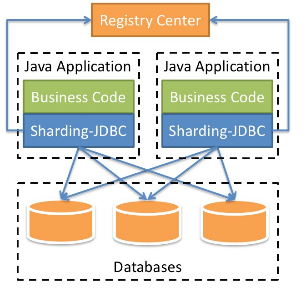
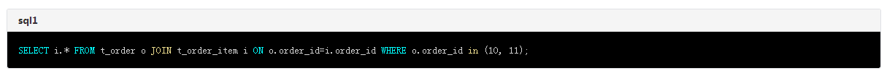
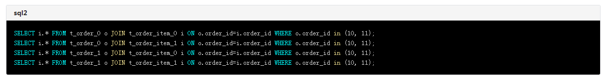
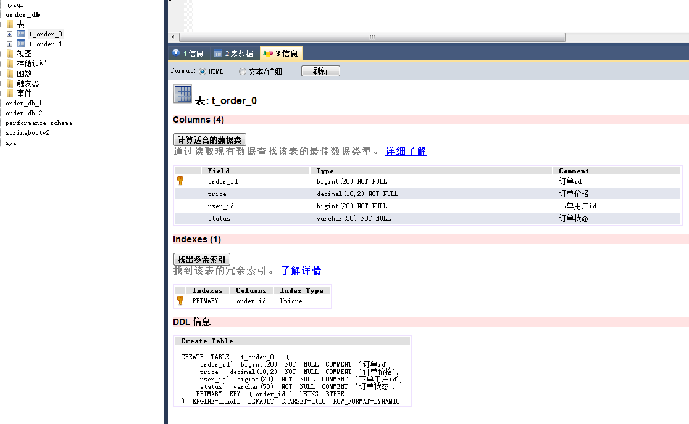
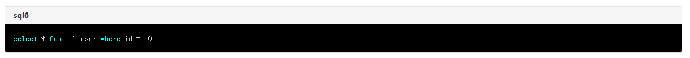
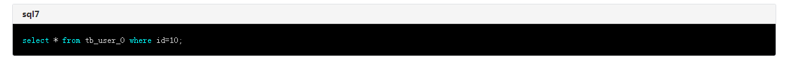
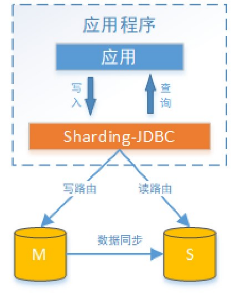
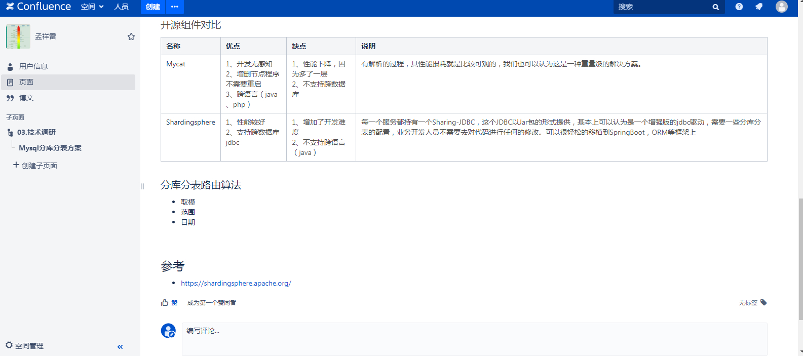

####  1）、sharding-jdbc 简介 ####

Sharding-JDBC定位为轻量级Java框架，在Java的JDBC层提供的额外服务，它使用客户端直连数据库，以jar包形式提供服务，无需额外部署和依赖，可理解为增强版的JDBC驱动，完全兼容JDBC和各种ORM框架。是分布式数据中间件Sharding-Sphere中的重要组成部分，

> 拓展： ShardingSphere 是一套开源的分布式数据库解决方案组成的生态圈，它由 JDBC、Proxy 和 Sidecar（规划中）这 3 款既能够独立部署，又支持混合部署配合使用的产品组成。 它们均提供标准化的数据水平扩展、分布式事务和分布式治理等功能
ShardingSphere 已于2020年4月16日成为 Apache 软件基金会的顶级项目。(Sharding-JDBC 是当当网开源)

- 适用于任何基于JDBC的ORM框架，如JPA,Hibernate,Mybatis,Spring JDBC Template或直接使用JDBC。
- 支持任何第三方的数据库连接池，如DBCP,C3P0,Druid,HikariCP等。
- 支持任意实现JDBC规范的数据库。目前支持MySQL,Oracle,SQLServer以及任何遵循SQL92标准的数据库。

#### 2）、sharding-jdbc能做什么？   ####

Sharding-JDBC的核心功能为数据分片和读写分离，通过sharding-JDBC，应用可以透明使用jdbc访问已经分库，读写分离的多个数据源，而不用关心数据源的数量以及数据如何分布。

**分库分表的基本概念**
> 什么是分库分表
>
- 就是把原本存储于一个库的数据分块存储到多个库上，把原本存储于一个表的数据分块存储到多个表上。

> 为什么分库分表
- 数据库中的数据量不一定是可控的，在未进行分库分表的情况下，随着时间和业务的发展，库中的表会越来越多，表中的数据量也会越来越大，相应地，数据操作，增删改查的开销也会越来越大；另外，由于无法进行分布式式部署，而一台服务器的资源（CPU、磁盘、内存、IO等）是有限的，最终数据库所能承载的数据量、数据处理能力都将遭遇瓶颈。

> 分库分表的实施策略
- 分库分表有垂直切分和水平切分两种。
 - 垂直切分，即将表按照功能模块、关系密切程度划分出来，部署到不同的库上。
 - 水平切分，当一个表中的数据量过大时，我们可以把该表的数据按照某种规则，例如orderId散列，进行划分，然后存储到多个结构相同的表，和不同的库上。

**1. sharding-jdbc核心概念：  **

- **逻辑表**：具有相同逻辑和数据结构的水平分片数据表。例如订单数据根据主键最后一个数字划分为10个表，他们是从tb_order_0到tb_order_9,其逻辑名称为tb_order。
- **实际表（物理表）**：真正存在于分片数据库的物理表，即tb_order_0到tb_order_9。
- **数据节点**：数据分片的最小单元。由数据源名称和数据表组成，例：ds_0.tb_order_0。
- **绑定表**：指分片规则一致的主表和子表。例如：tb_order表和tb_order_item表，均按照order_id分片，则此两张表互为绑定表关系。绑定表之间的多表关联查询不会出现笛卡尔积关联，关联查询效率将大大提升。

举例说明，如果SQL为：

在不配置绑定表关系时，假设分片键order_id 将数值10路由至第0片，将数值11路由至第1片，那么路由后的SQL应该为4条，他们会出现笛卡尔积现象：

在配置绑定表配置后，路由的SQL应该为2条：

> 
SELECT i.* FROM t_order_0 o JOIN t_order_item_0 i ON o.order_id=i.order_id WHERE o.order_id in (10, 11); 
SELECT i.* FROM t_order_1 o JOIN t_order_item_1 i ON o.order_id=i.order_id WHERE o.order_id in (10, 11);

其中t_order在FROM的最左侧，ShardingSphere将会以它作为整个绑定表的主表。 所有路由计算将会只使用主表的策略，那么t_order_item表的分片计算将会使用t_order的条件。故绑定表之间的分区键要完全相同。

**2. sharding-jdbc分片键，算法，策略：  **

**概述**

- ** 分片键**：用于分片的数据库字段，是将数据库(表)水平拆分的关键字段。例：将订单表中的订单主键的取模分片，则订单主键为分片字段。

-  **分片算法**：通过分片算法将数据分片，支持通过=、>=、<=、>、<、BETWEEN和IN分片。分片算法需要应用方开发者自行实现，可实现的灵活度非常高。

> 目前提供4种分片算法。由于分片算法和业务实现紧密相关，因此并未提供内置分片算法，而是通过分片策略将各种场景提炼出来，提供更高层级的抽象，并提供接口让应用开发者自行实现分片算法。

**分片算法**

- ** 精确分片算法**
用于处理使用单一键作为分片键的=与IN进行分片的场景

-  **范围分片算法**
用于处理使用单一键作为分片键的BETWEEN AND、>、<、>=、<=进行分片的场景

- **复合分片算法**
用于处理使用多键作为分片键进行分片的场景

- **Hint分片算法**
himt指定分值而不从 SQL 中提取，而是手工设置的方式，不是来自于分片建，甚至连分片建都没有 ，而由其他外置条件决定的场景，可使用Hint分片算法 。
就需要通过 Java API 等方式指定分片值，这也叫强制路由
例： 内部系统，按照员⼯登录主键分库，而数据库中并未此字段。

**分片策略**

> 分片策略是一种抽象的概念，实际分片操作的是由分片算法和分片健来完成的。

- **标准分片策略**  StandardShardingStrategy
提供对SQL语句中的=, >, <, >=, <=, IN和BETWEEN AND的分片操作支持。标准分片策略只支持单分片键，提供精确分片算法和范围分片算法两个分片算法。 
精确分片算法是必选的，用于处理=和IN 的分片。
范围分片算法是可选的，用于处理BETWEEN AND, >, <, >=, <=分片，如果不配置范围分片算法，SQL中的BETWEEN AND将按照全库路由处理。 

- **复合分片策略** ComplexShardingStrategy
提供对SQL语句中的=, >, <, >=, <=, IN和BETWEEN AND的分片操作支持。支持多分片键

- **行表达式分片策略** InlineShardingStrategy
使用的表达式，提供对SQL语句中的=和IN的分片操作支持，只支持单分片键。对于简单的分片算法，可以通过简单的配置使用，从而避免繁琐的Java代码开发，如: t_user_$->{u_id % 8} 表示t_user表根据u_id模8，而分成8张表，表名称为t_user_0到t_user_7。

- **Hint分片策略** HintShardingStrategy
通过Hint指定分片值而非从SQL中提取分片值的方式进行分片的策略。

-  **不分片策略**  NoneShardingStrategy 
不分片的策略。

> 捋一下它们之间的关系，分片策略只是抽象出的概念，它是由分片算法和分片健组合而成，分片算法做具体的数据分片逻辑。

**3. sharding-jdbc实战，了解原理：  **

- **需求**

>使用sharding-jdbc完成对订单表的水平分表，通过快速入门的开发，了解sharding-jdbc使用方法
> 
> 人工创建两张表，t_order_1和t_order_2，这两张表是订单表拆分后的表，通过sharding-jdbc向订单表插入数据，按照一定的分片规则，主键为偶数的进入t_order_1，另一部分数据进入t_order_2，通过 sharding-jdbc查询数据，根据SQL语句的内容从t_order_1或t_order_2查询数据。

- **结论** 
 - 解析sql，获取分片键值，在本例中是order_id。	
 - Sharding-JDBC通过规则配置 t_order_$->{order_id % 2}，知道了当order_id为偶数时，应该往t_order_1表插数据，为奇数时，往t_order_2插数据。
 - 于是Sharding-JDBC根据order_id的值改写sql语句，改写后的SQL语句是真实所要执行的SQL语句。
 - 执行改写后的真实sql语句。
 -  将所有真正执行sql的结果进行汇总合并，返回。

- **sharding-jdbc执行原理**

- **总结**
由图可知，在sql执行过程中需要经过几个过程：
例如现在有一条查询语句：

 > 进行了分表操作，采用的分片键为id,逻辑表为tb_user，真实表为 tb_user_0，tb_user_1两张表，分表算法均为取余(%2)。
- **sql解析：通过解析sql语句提取分片键列与值进行分片，例如比较符 =、in、 between and,及查询的表等**

- **sql改写：根据解析结果，及采用的分片逻辑改写sql，上例经过sql改写之后，真实的语句为：**
 

- **sql路由：找到sql需要去哪个表执行语句，上例sql根据采用的策略可以得到将在tb_user_0表执行语句。**

- **sql执行：执行改写后的sql。**

- **结果归并：当我们执行某些复杂语句时，sql可能会在多个库、多个表中执行，sql分别对应执行后会对结果集进行归并操作，得到最终的结果。**

**4. sharding-jdbc读写分离  **

####  查看配置代码 ####

**5. Mycat区别  **
