# 分布式链路追踪

分布式系统为什么需要链路追踪？

随着互联网业务快速扩展，软件架构也日益变得复杂，为了适应海量用户高并发请求，系统中越来越多的组件开始走向分布式化，如单体架构拆分为微服务、服务内缓存变为分布式缓存、服务组件通信变为分布式消息，这些组件共同构成了繁杂的分布式网络。

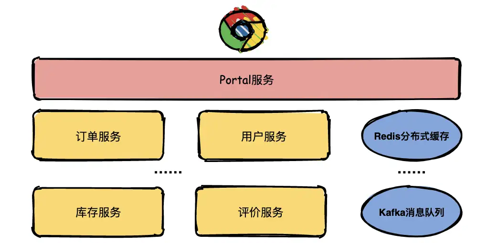

假如现在有一个系统部署了成千上万个服务，用户通过浏览器在主界面上下单一箱茅台酒，结果系统给用户提示：系统内部错误，相信用户是很崩溃的。

运营人员将问题抛给开发人员定位，开发人员只知道有异常，但是这个异常具体是由哪个微服务引起的就需要逐个服务排查了。

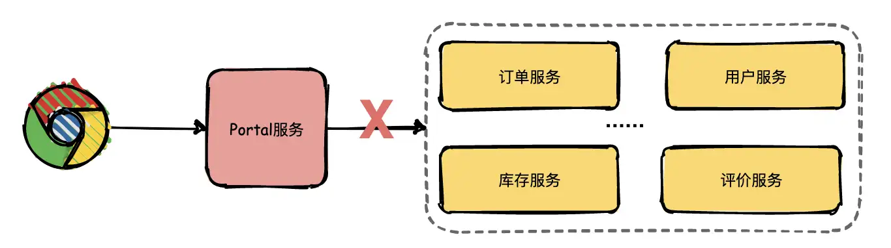

开发人员借助日志逐个排查的效率是非常低的，那有没有更好的解决方案了？**答案是引入链路追踪系统。**

## **什么是链路追踪？**

分布式链路追踪就是将一次分布式请求还原成调用链路，将一次分布式请求的调用情况集中展示，比如各个服务节点上的耗时、请求具体到达哪台机器上、每个服务节点的请求状态等等。

**链路跟踪主要功能：**

- **故障快速定位**：可以通过调用链结合业务日志快速定位错误信息。
- **链路性能可视化**：各个阶段链路耗时、服务依赖关系可以通过可视化界面展现出来。
- **链路分析**：通过分析链路耗时、服务依赖关系可以得到用户的行为路径，汇总分析应用在很多业务场景。

## **链路追踪基本原理**

链路追踪系统（可能）最早是由Goggle公开发布的一篇论文《Dapper, a Large-Scale Distributed Systems Tracing Infrastructure》被大家广泛熟悉，所以各位技术大牛们如果有黑武器不要藏起来赶紧去发表论文吧。

在这篇著名的论文中主要讲述了Dapper链路追踪系统的基本原理和关键技术点。接下来挑几个重点的技术点详细给大家介绍一下。

## **Trace**

Trace的含义比较直观，就是链路，指一个请求经过所有服务的路径，可以用下面树状的图形表示。

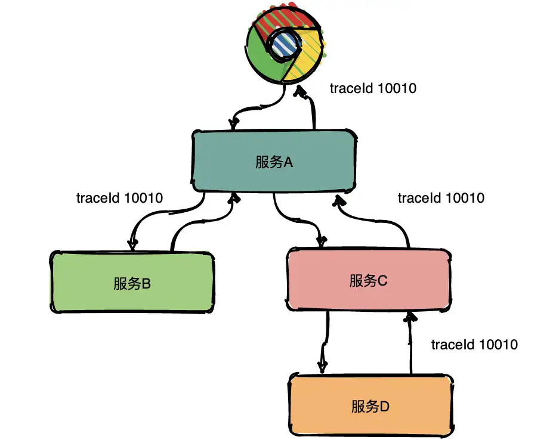

图中一条完整的链路是：chrome -> 服务A -> 服务B -> 服务C -> 服务D ->  服务C -> 服务A -> chrome。服务间经过的局部链路构成了一条完整的链路，其中每一条局部链路都用一个全局唯一的traceid来标识。

## **Span**

在上图中可以看出来请求经过了服务A，同时服务A又调用了服务B和服务C，但是先调的服务B还是服务C呢？从图中很难看出来，只有通过查看源码才知道顺序。

为了表达这种父子关系引入了Span的概念。

同一层级parent id相同，span id不同，span id从小到大表示请求的顺序，从下图中可以很明显看出服务A是先调了服务B然后再调用了C。

上下层级代表调用关系，如下图服务C的span id为2，服务D的parent id为2，这就表示服务C和服务D形成了父子关系，很明显是服务C调用了服务D。

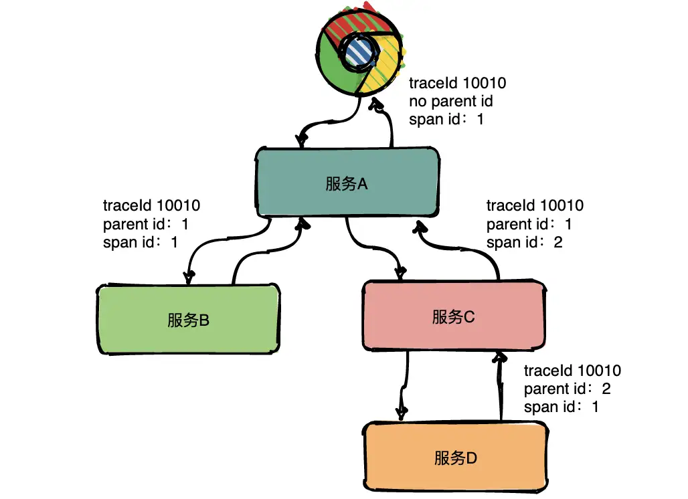

**总结：通过事先在日志中埋点，找出相同traceId的日志，再加上parent id和span id就可以将一条完整的请求调用链串联起来。**

## **Annotations**

Dapper中还定义了annotation的概念，用于用户自定义事件，用来辅助定位问题。

**通常包含四个注解信息**： cs：Client Start，表示客户端发起请求； sr：ServerReceived，表示服务端收到请求； ss： Server Send，表示服务端完成处理，并将结果发送给客户端； cr：ClientReceived，表示客户端获取到服务端返回信息；

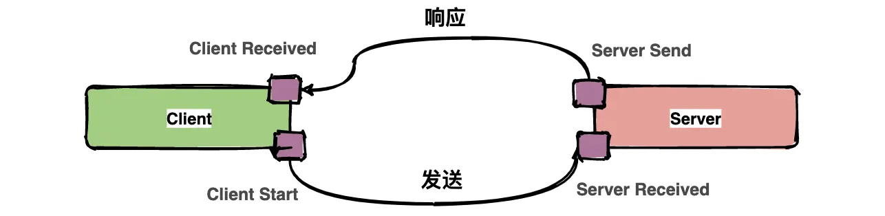

上图中描述了一次请求和响应的过程，四个点也就是对应四个Annotation事件。

如下面的图表示从客户端调用服务端的一次完整过程。如果要计算一次调用的耗时，只需要将客户端接收的时间点减去客户端开始的时间点，也就是图中时间线上的T4 - T1。如果要计算客户端发送网络耗时，也就是图中时间线上的T2 - T1，其他类似可计算。

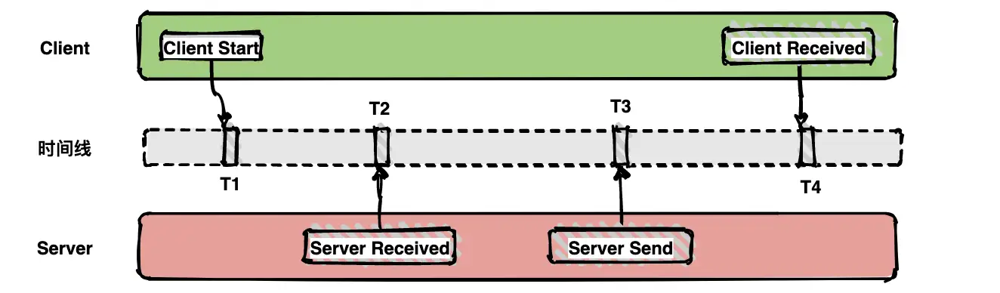

**带内数据与带外数据**

链路信息的还原依赖于**带内**和**带外**两种数据。

带外数据是各个节点产生的事件，如cs，ss，这些数据可以由节点独立生成，并且需要集中上报到存储端。通过带外数据，可以在存储端分析更多链路的细节。

带内数据如traceid,spanid,parentid，用来标识trace，span，以及span在一个trace中的位置，这些数据需要从链路的起点一直传递到终点。 通过带内数据的传递，可以将一个链路的所有过程串起来。

## **采样**

由于每一个请求都会生成一个链路，为了减少性能消耗，避免存储资源的浪费，dapper并不会上报所有的span数据，而是使用采样的方式。举个例子，每秒有1000个请求访问系统，如果设置采样率为1/1000，那么只会上报一个请求到存储端。

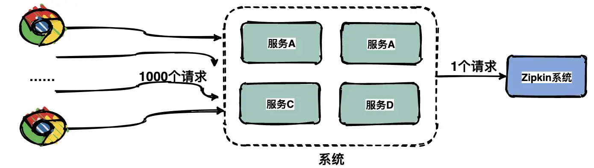

通过采集端自适应地调整采样率，控制span上报的数量，可以在发现性能瓶颈的同时，有效减少性能损耗。

## **存储**

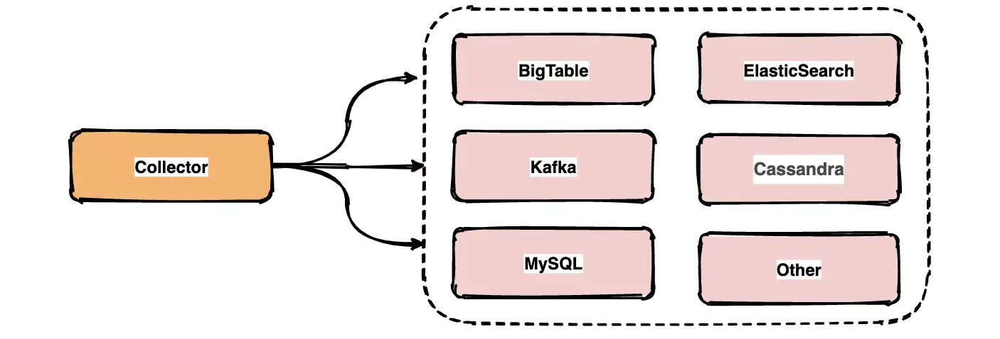

链路中的span数据经过收集和上报后会集中存储在一个地方，Dapper使用了BigTable数据仓库，常用的存储还有ElasticSearch, HBase, In-memory DB等。

## **业界常用链路追踪系统**

Google Dapper论文发出来之后，很多公司基于链路追踪的基本原理给出了各自的解决方案，如Twitter的Zipkin，Uber的Jaeger，pinpoint，Apache开源的skywalking，还有国产如阿里的鹰眼，美团的Mtrace，滴滴Trace，新浪的Watchman，京东的Hydra，不过国内的这些基本都没有开源。

为了便于各系统间能彼此兼容互通，OpenTracing组织制定了一系列标准，旨在让各系统提供统一的接口。

下面对比一下几个开源组件，方便日后大家做技术选型。

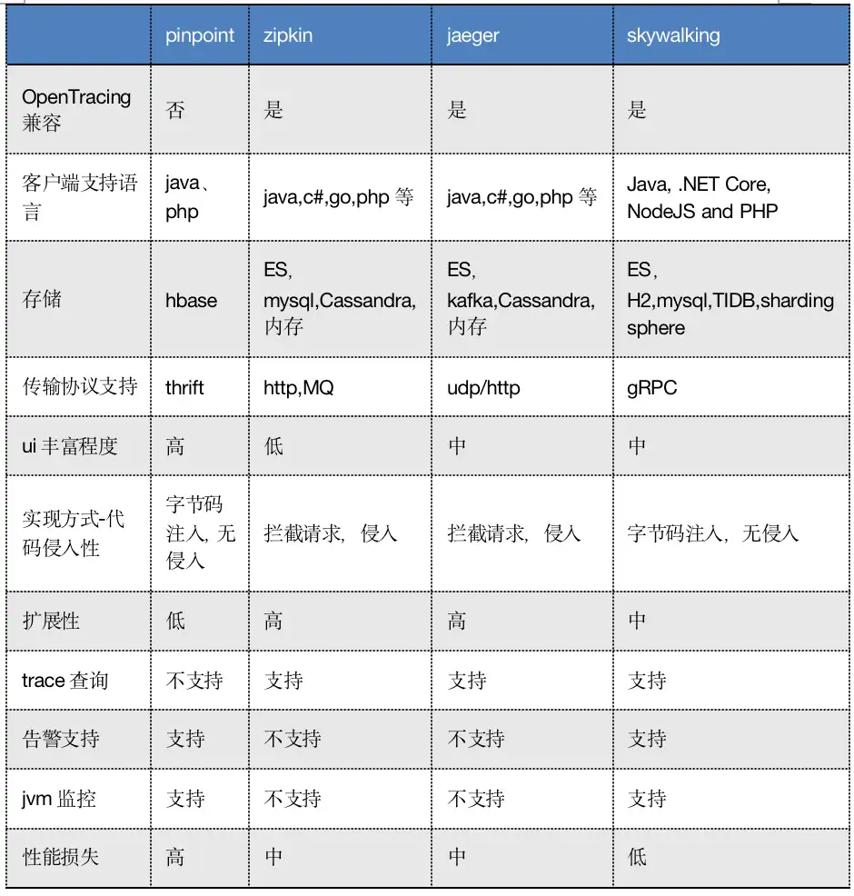

接下来介绍一下Zipkin基本实现。

## **分布式链路追踪系统Zipkin实现**

Zipkin 是 Twitter 的一个开源项目，它基于 Google Dapper 实现，它致力于收集服务的定时数据，以解决微服务架构中的延迟问题，包括数据的收集、存储、查找和展现。

## **Zipkin基本架构**

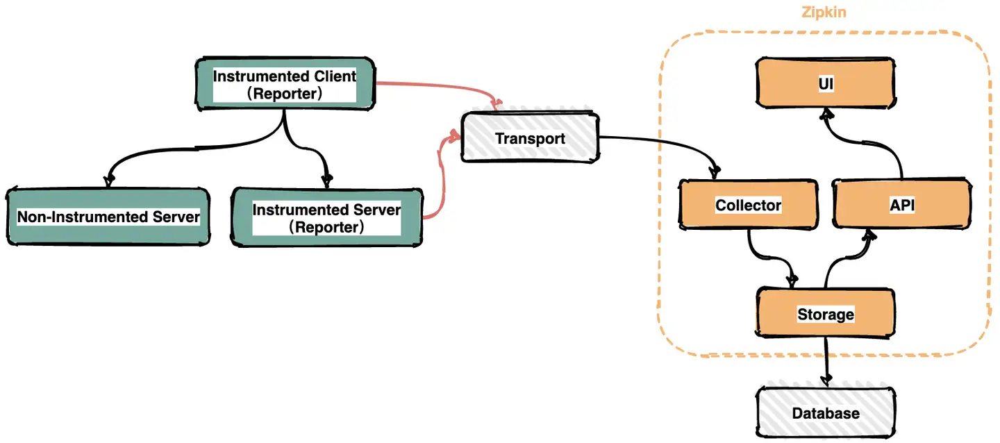

在服务运行的过程中会产生很多链路信息，产生数据的地方可以称之为Reporter。将链路信息通过多种传输方式如HTTP，RPC，kafka消息队列等发送到Zipkin的采集器，Zipkin处理后最终将链路信息保存到存储器中。运维人员通过UI界面调用接口即可查询调用链信息。

## **Zipkin核心组件**

Zipkin有四大核心组件

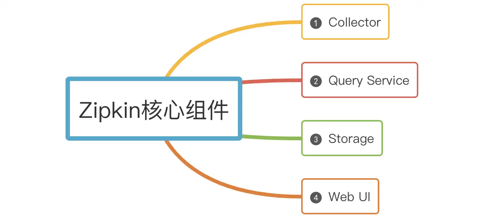

**（1）Collector**

一旦Collector采集线程获取到链路追踪数据，Zipkin就会对其进行验证、存储和索引，并调用存储接口保存数据，以便进行查找。

**（2）Storage**

Zipkin Storage最初是为了在Cassandra上存储数据而构建的，因为Cassandra是可伸缩的，具有灵活的模式，并且在Twitter中大量使用。除了Cassandra，还支持支持ElasticSearch和MySQL存储，后续可能会提供第三方扩展。

**（3）Query Service**

链路追踪数据被存储和索引之后，webui 可以调用query service查询任意数据帮助运维人员快速定位线上问题。query service提供了简单的json api来查找和检索数据。

**（4）Web UI**

Zipkin 提供了基本查询、搜索的web界面，运维人员可以根据具体的调用链信息快速识别线上问题。

## **总结**

分布式链路追踪就是将每一次分布式请求还原成调用链路。

1. 链路追踪的核心概念：Trace、Span、Annotation、带内和带外数据、采样、存储。
2. 业界常用的开源组件都是基于谷歌Dapper论文演变而来；
3. Zipkin核心组件有：Collector、Storage、Query Service、Web UI。